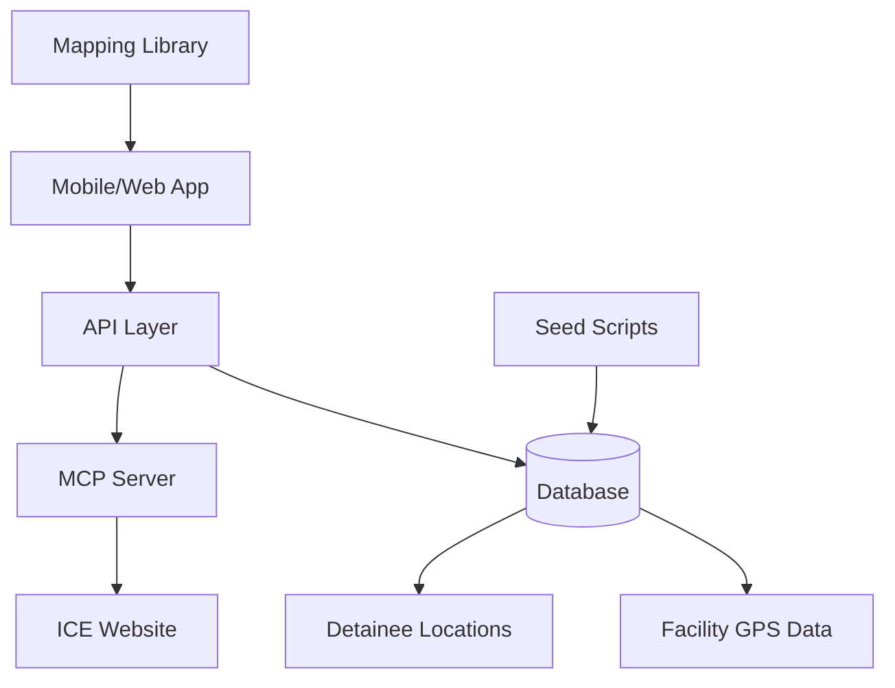
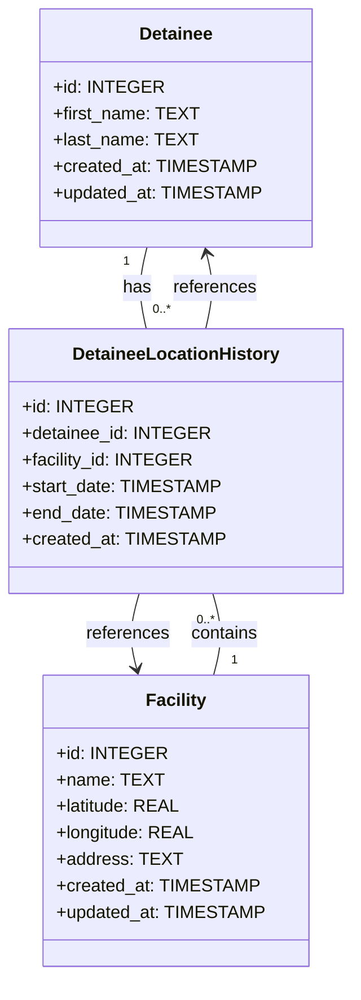

# Add Map View to Landing Page

## Overview

This feature will add a map view to the top of the landing page/app home pages that shows a heatmap using the currently known locations of detainees. The feature will include:

1. A database to store detainee name & location data
2. A database table to store facility locations with name & GPS coordinates
3. A script to populate the database from `enriched_detainees.csv`
4. A script to gather actual locations for facilities (seed_facility_locations)
5. Integration of a mapping/heatmap library into the web and mobile apps
6. Vercel deployment of the web app with a separate API layer for heatmap data

## Architecture

### System Components

### Data Flow

1. Initial data population from `enriched_detainees.csv`
2. Facility location gathering via external APIs or manual input
3. Daily updates from MCP server to track facility transfers
4. Storage of anonymized detainee location data (no A-numbers or DOB)
5. API layer serves aggregated data for heatmap visualization
6. Map rendering using heatmap visualization

## Database Schema

### UML Diagram

### Detainee Table

PostgreSQL database table with columns for id, first_name, last_name, created_at timestamp, and updated_at timestamp.

### Facility Table

PostgreSQL database table with columns for id, name, latitude, longitude, address, created_at timestamp, and updated_at timestamp.

### Detainee Location History Table

PostgreSQL database table to track detainee location changes over time with columns for id, detainee_id (foreign key to Detainee), facility_id (foreign key to Facility), start_date, end_date, and created_at timestamp. When a detainee is currently at a facility, the end_date will be NULL.

## Technology Stack & Dependencies

### Mapping Libraries
- **Leaflet.js** with **Leaflet.heat** for web heatmap visualization
- **react-native-maps** with custom heatmap implementation for mobile

### Database
- **PostgreSQL** for API layer data storage

### Backend
- **Python** with **psycopg2** for database operations
- **Flask/FastAPI** for API layer
- **Vercel** for frontend deployment

### Frontend
- **React Native** for mobile app
- **HTML/CSS/JavaScript** for web app

## Component Architecture

### Backend Components

#### Database Manager
- Handles PostgreSQL database operations
- Provides CRUD operations for detainee locations and facility data

#### Data Seeding Scripts
- `populate_detainee_locations.py`: Populates detainee data from `enriched_detainees.csv`
- `seed_facility_locations.py`: Gathers GPS coordinates for facilities

#### Data Update Scripts
- `update_detainee_locations.py`: Daily cron job that queries MCP for facility updates and stores new data

#### API Layer
- Lightweight Flask/FastAPI server for serving heatmap data
- Public endpoints for facility coordinates and detainee location data
- Rate limiting and security measures for public access

### Frontend Components

#### Web App
- Map component at the top of the landing page
- Heatmap visualization using Leaflet.js
- Responsive design for different screen sizes

#### Mobile App
- Map view integrated into the main screen
- Heatmap visualization using react-native-maps
- Performance optimizations for mobile devices

## API Endpoints

### New MCP Tools

#### get_facility_coordinates

MCP tool that returns GPS coordinates for all facilities. No input parameters required.

#### get_current_detainee_locations

MCP tool that returns current detainee locations with facility information. No input parameters required.

### Public API Endpoints

#### GET /api/facilities

Returns a list of all facilities with their GPS coordinates for heatmap rendering.

#### GET /api/facility/{id}/current-detainees

Returns current detainee count for a specific facility.

#### GET /api/heatmap-data

Returns aggregated data for heatmap visualization, including facility coordinates and detainee counts.

## Data Models

### Detainee (Python)

Python dataclass with fields for id, first_name, last_name, created_at, and updated_at.

### Facility (Python)

Python dataclass with fields for id, name, latitude, longitude, address, created_at, and updated_at.

### DetaineeLocationHistory (Python)

Python dataclass with fields for id, detainee_id, facility_id, start_date, end_date, and created_at.

## State Management

### Web App
- Global state for map data using simple JavaScript objects
- Loading states for async data fetching
- Error handling for map rendering

### Mobile App
- React state hooks for map data management
- Loading indicators for data fetching
- Error boundaries for map component

## Styling Strategy

### Web App
- CSS for map container styling
- Responsive design for different viewport sizes
- Consistent color scheme with existing app

### Mobile App
- React Native StyleSheet for map component
- Platform-specific styling for iOS/Android
- Adaptive layout for different screen sizes

## Testing Strategy

### Unit Tests
- Database operations (CRUD for all three tables)
- Foreign key relationship validation
- Data seeding scripts
- Location history tracking functionality
- MCP tool implementations
- API endpoint tests

### Integration Tests
- End-to-end map data flow
- API endpoint responses
- Privacy compliance validation

### UI Tests
- Map rendering on web and mobile
- Heatmap visualization accuracy
- Responsive design verification

### Code Coverage
- Target minimum 80% code coverage for all new functionality
- Track coverage for database operations, MCP tools, and data seeding scripts
- Generate coverage reports using pytest-cov for Python components
- Exclude migration scripts and configuration files from coverage metrics
- Set up coverage reporting in CI/CD pipeline to prevent merging code that reduces overall coverage

## Vercel Deployment

### Vercel Configuration
Vercel deployment configuration for the frontend web application. The static web assets will be deployed to Vercel for global CDN distribution and optimal performance.

### API Deployment
The API layer will be deployed to a cloud provider that supports Python applications (such as Render or Railway) with PostgreSQL database hosting.

## Implementation Plan

### Phase 1: Database and Data Seeding
1. Create PostgreSQL database schema with three tables (Detainee, Facility, DetaineeLocationHistory)
2. Implement database manager class with foreign key relationships
3. Create `populate_detainee_locations.py` script
4. Create `seed_facility_locations.py` script
5. Create `populate_location_history.py` script to track location changes over time
6. Create `update_detainee_locations.py` script for daily cron job
7. Unit tests for database operations

### Phase 2: API Layer Development
1. Create lightweight Flask/FastAPI server for heatmap data
2. Implement public endpoints for facility and location data
3. Add security measures and rate limiting
4. Integration tests for API endpoints

### Phase 3: Web App Implementation
1. Integrate Leaflet.js and Leaflet.heat
2. Create map component
3. Implement data fetching from API layer
4. Style and position map on landing page

### Phase 4: Mobile App Implementation
1. Integrate react-native-maps
2. Implement heatmap visualization
3. Position map view on main screen
4. Optimize for mobile performance

### Phase 5: Deployment
1. Deploy frontend to Vercel
2. Deploy API layer to cloud provider
3. Set up PostgreSQL database
4. Configure environment variables
5. Test deployment and performance

## Privacy and Security Considerations

1. **No PII Storage**: The database will not store alien numbers or dates of birth
2. **Data Aggregation**: Map data will be aggregated to prevent individual identification
3. **Local Processing**: All data processing occurs locally, no external data transmission
4. **Secure Configuration**: Database files will be stored in secure volumes when containerized

## Performance Considerations

1. **Database Indexing**: Proper indexing on facility names for fast lookups
2. **Data Caching**: Cache map data in the frontend to reduce API calls
3. **Efficient Queries**: Aggregated queries for heatmap data instead of individual points
4. **Mobile Optimization**: Clustered rendering for large datasets on mobile devices

## Project Rules and Best Practices

### Development Principles

1. **DRY (Don't Repeat Yourself)**
   - Extract common functionality into reusable modules and functions
   - Create utility functions for repeated operations
   - Use constants for shared values like API endpoints and database queries
   - Implement shared components for UI elements used across the application

2. **SOLID Principles**
   - **Single Responsibility**: Each class and function should have one clear purpose
   - **Open/Closed**: Design modules to be open for extension but closed for modification
   - **Liskov Substitution**: Ensure derived classes can substitute their base classes
   - **Interface Segregation**: Create specific interfaces rather than general-purpose ones
   - **Dependency Inversion**: Depend on abstractions rather than concrete implementations

3. **Code Quality Standards**
   - Follow PEP 8 style guide for Python code
   - Use meaningful variable and function names
   - Write comprehensive docstrings for all public functions and classes
   - Maintain consistent code formatting using tools like Black or autopep8
   - Implement proper error handling and logging throughout the application

### Git Workflow

1. **Git Flow Branching Strategy**
   - Create feature branches from `main` for new functionality
   - Use descriptive branch names (e.g., `feature/map-view-implementation`)
   - Submit pull requests for code review before merging to `main`
   - Delete feature branches after successful merge
   - Use `develop` branch for integration of multiple features

2. **Commit Best Practices**
   - Make small, focused commits that represent single logical changes
   - Write clear, concise commit messages in imperative mood
   - Reference issue numbers in commit messages when applicable
   - Squash related commits before merging to maintain clean history
   - Avoid committing sensitive information or large binary files

3. **Code Review Process**
   - All code changes must be reviewed before merging
   - Reviewers should check for adherence to project standards
   - Automated tests must pass before code can be merged
   - Address all review comments before merging

### Testing Requirements

1. **Comprehensive Test Coverage**
   - Maintain minimum 80% code coverage for new functionality
   - Write unit tests for all business logic and data processing functions
   - Implement integration tests for API endpoints and database operations
   - Include end-to-end tests for critical user workflows
   - Never skip tests or use mock/fake data - always use real data and system interactions

2. **Test Execution**
   - Run all tests in isolation before submitting pull requests
   - Validate functionality in test environments before production deployment
   - Ensure all tests pass without exceptions before merging code

### Security Practices

1. **Data Privacy**
   - Never store sensitive information like alien numbers or dates of birth
   - Implement proper data anonymization for public APIs
   - Follow privacy-by-design principles in all components

2. **API Security**
   - Implement rate limiting on public API endpoints
   - Add proper input validation and sanitization
   - Use secure headers and CORS policies
   - Regularly update dependencies to address security vulnerabilities

## Deployment

The application will be deployed using a combination of services:
- Frontend web application deployed to Vercel for global CDN distribution
- API layer deployed to a Python-compatible cloud provider
- PostgreSQL database for data persistence
- MCP server running locally or on a separate server

## Project Completion Checklist

### Database Developer Tasks

#### Phase 1: Database Schema Implementation
- [ ] Create PostgreSQL database schema with three tables (Detainee, Facility, DetaineeLocationHistory)
- [ ] Implement foreign key relationships between tables
- [ ] Add proper indexing on facility names and other frequently queried columns
- [ ] Set up database connection utilities and configuration management
- [ ] Create database migration scripts for version control

#### Phase 2: Data Seeding and Update Scripts
- [ ] Create `populate_detainee_locations.py` script to populate initial data from `enriched_detainees.csv`
- [ ] Create `seed_facility_locations.py` script to gather GPS coordinates for facilities
- [ ] Create `populate_location_history.py` script to track location changes over time
- [ ] Create `update_detainee_locations.py` script for daily cron job to track facility transfers
- [ ] Implement error handling and logging in all data scripts
- [ ] Add validation checks to ensure data integrity during seeding and updates

### Backend Developer Tasks

#### Phase 1: API Layer Development
- [ ] Set up Flask/FastAPI server framework
- [ ] Implement database connection pooling for efficient resource usage
- [ ] Create data access layer (DAO) for database operations
- [ ] Implement public API endpoints:
  - [ ] GET /api/facilities - Returns all facilities with GPS coordinates
  - [ ] GET /api/facility/{id}/current-detainees - Returns current detainee count for a facility
  - [ ] GET /api/heatmap-data - Returns aggregated data for heatmap visualization
- [ ] Add rate limiting to prevent API abuse
- [ ] Implement input validation and sanitization for all endpoints
- [ ] Add comprehensive error handling and meaningful error responses
- [ ] Implement logging for API requests and errors

#### Phase 2: Security Implementation
- [ ] Configure CORS policies for web app access
- [ ] Add security headers to API responses
- [ ] Implement request throttling based on IP addresses
- [ ] Set up monitoring and alerting for suspicious activity
- [ ] Add health check endpoints for deployment monitoring

#### Phase 3: Testing and Quality Assurance
- [ ] Write unit tests for all API endpoints
- [ ] Create integration tests for database operations
- [ ] Implement test coverage reporting (minimum 80% coverage)
- [ ] Set up continuous integration pipeline for automated testing
- [ ] Perform load testing to ensure API performance under stress

### Frontend Developer Tasks

#### Phase 1: Web App Implementation
- [ ] Integrate Leaflet.js and Leaflet.heat libraries
- [ ] Create responsive map component for landing page
- [ ] Implement data fetching from API layer
- [ ] Design heatmap visualization with appropriate color schemes
- [ ] Add loading states and error handling for map data
- [ ] Implement responsive design for different screen sizes
- [ ] Add accessibility features for screen readers

#### Phase 2: Mobile App Implementation
- [ ] Integrate react-native-maps library
- [ ] Implement custom heatmap visualization for mobile
- [ ] Position map view on main screen
- [ ] Optimize rendering performance for mobile devices
- [ ] Implement offline caching for map data
- [ ] Add platform-specific styling for iOS and Android

#### Phase 3: UI/UX Enhancements
- [ ] Add map controls (zoom, pan, etc.)
- [ ] Implement facility information popups on map click
- [ ] Add search functionality to find specific facilities
- [ ] Create legend and information panel for heatmap interpretation
- [ ] Implement dark mode support
- [ ] Add loading indicators and smooth transitions

### DevOps Engineer Tasks

#### Phase 1: Deployment Configuration
- [ ] Set up Vercel deployment for frontend web application
- [ ] Configure custom domain and SSL certificates
- [ ] Set up API layer deployment to cloud provider
- [ ] Configure PostgreSQL database hosting
- [ ] Set up environment variables and configuration management
- [ ] Implement CI/CD pipeline for automated deployments

#### Phase 2: Monitoring and Maintenance
- [ ] Set up application monitoring and logging
- [ ] Configure automated backups for database
- [ ] Implement alerting for system failures
- [ ] Set up performance monitoring for API endpoints
- [ ] Configure daily cron job for data updates
- [ ] Create disaster recovery procedures

### Quality Assurance Engineer Tasks

#### Phase 1: Test Planning and Execution
- [ ] Create test plan for all components
- [ ] Execute unit tests for database operations
- [ ] Run integration tests for API endpoints
- [ ] Perform end-to-end testing for web and mobile apps
- [ ] Conduct security testing for public API endpoints
- [ ] Validate privacy compliance for data handling

#### Phase 2: Performance and Usability Testing
- [ ] Conduct performance testing for heatmap rendering
- [ ] Test mobile app on different device sizes and OS versions
- [ ] Validate accessibility compliance
- [ ] Perform cross-browser testing for web app
- [ ] Test error handling and graceful degradation

### Project Manager Tasks

#### Phase 1: Project Coordination
- [ ] Create detailed project timeline with milestones
- [ ] Assign tasks to team members based on expertise
- [ ] Set up regular team check-ins and progress reviews
- [ ] Track dependencies between different components
- [ ] Manage risk assessment and mitigation strategies

#### Phase 2: Documentation and Delivery
- [ ] Create user documentation for map features
- [ ] Document API endpoints and usage examples
- [ ] Prepare deployment guides for different environments
- [ ] Conduct final project review and retrospective
- [ ] Ensure all acceptance criteria are met before delivery

## Task Dependencies

1. **Database Implementation** must be completed before **API Layer Development**
2. **API Layer** must be functional before **Frontend Implementation**
3. **Data Seeding Scripts** must run successfully before **API Testing**
4. **Web App Implementation** should be completed before **Mobile App Implementation** to establish UI patterns
5. **Backend Testing** must pass before **Frontend Integration Testing**
6. **All Component Testing** must pass before **Deployment Configuration**
7. **Deployment** can only proceed after **Security Implementation** is complete
8. **Quality Assurance** tasks run in parallel with development but must complete before final delivery