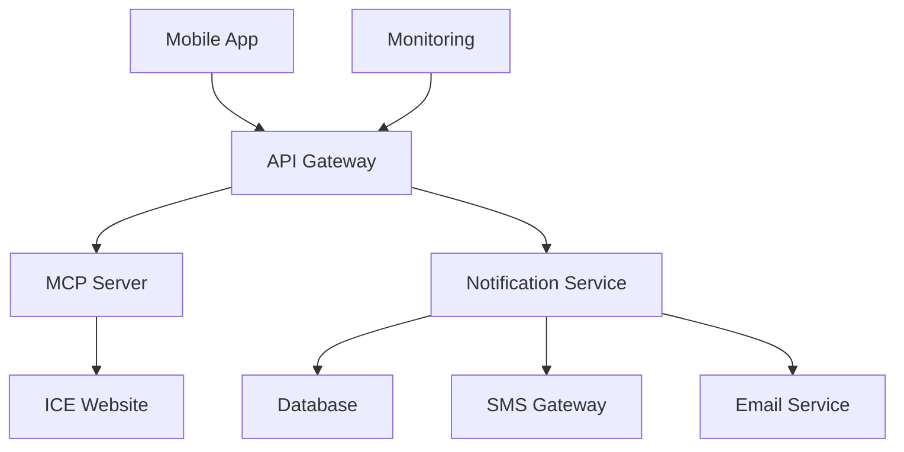
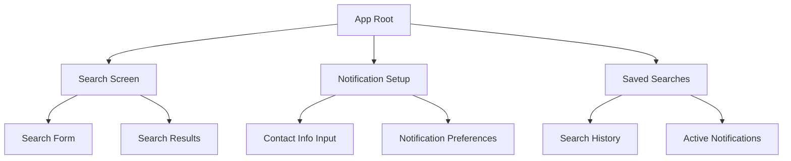
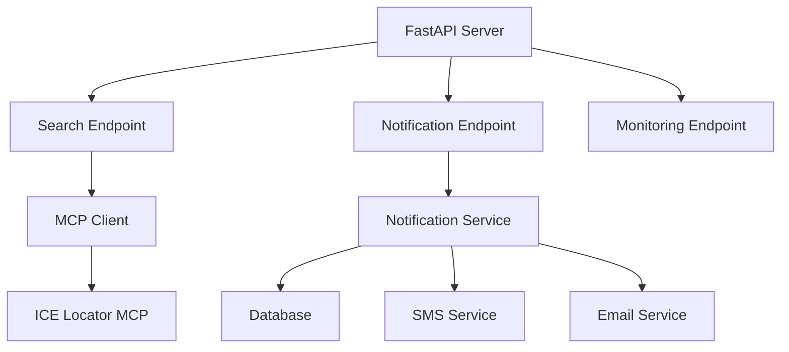
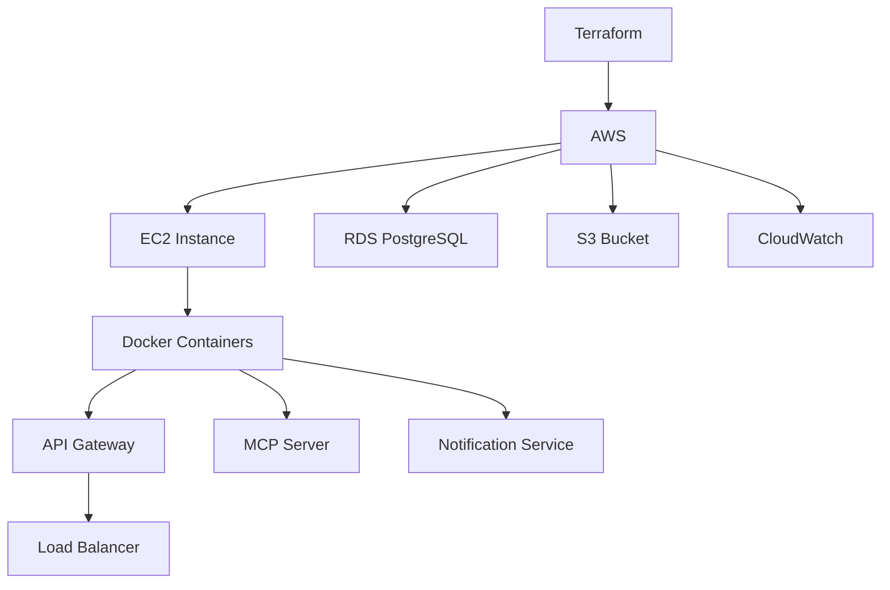

# Mobile App Feature Branch Setup for ICE Locator

## 1. Overview

This document outlines the design and implementation plan for a mobile application that enables users to search for ICE detainees by name and receive notifications when a detainee's status or location changes. The mobile app will integrate with the existing ICE Locator MCP server to perform searches and store notification preferences.

### Key Features
- Search for detainees by name, date of birth, and country of birth
- Request notifications via SMS or email when detainee status changes
- Store provided contact information for continuous monitoring
- Privacy-first approach with automatic data redaction

### Technical Approach
- Extend existing MCP server with notification capabilities
- Implement mobile backend services for notification management
- Use Terraform for infrastructure deployment
- Integrate with free/cheap SMS and email services

## 2. System Architecture

### High-Level Architecture


### Component Description
1. **Mobile App**: React Native cross-platform application for iOS and Android
2. **API Gateway**: FastAPI-based REST API for handling mobile requests
3. **MCP Server**: Existing ICE Locator MCP server for search operations
4. **Notification Service**: New service for managing notifications and monitoring
5. **Database**: PostgreSQL for storing notification preferences and contact info
6. **SMS Gateway**: Twilio or similar service for SMS notifications
7. **Email Service**: SMTP or cloud email service for email notifications
8. **Monitoring**: Existing MCPcat integration for system monitoring

## 3. Mobile Application Design

### Component Architecture


### Core Components
1. **Search Screen**
   - Form for entering detainee name, date of birth, country of birth
   - Submit button to trigger search via MCP server
   - Display of search results with detainee information

2. **Notification Setup**
   - Form for entering phone number or email address
   - Selection of notification preferences (SMS, email, or both)
   - Submit button to register for notifications

3. **Saved Searches**
   - List of previous searches
   - List of active notifications
   - Ability to remove notifications

### State Management
- Redux for global state management
- AsyncStorage for persisting search history locally
- Context API for theme and localization

## 4. Backend Services

### API Gateway Design


### API Endpoints
1. **Search Operations**
   - `POST /api/search/name` - Search detainee by name
   - `POST /api/search/alien-number` - Search detainee by alien number

2. **Notification Management**
   - `POST /api/notifications` - Register for notifications
   - `GET /api/notifications/{id}` - Get notification status
   - `DELETE /api/notifications/{id}` - Remove notification
   - `GET /api/notifications` - List all notifications

3. **Monitoring**
   - `GET /api/health` - Health check endpoint
   - `GET /api/metrics` - Performance metrics

### Notification Service
The notification service will:
1. Store user contact information and notification preferences
2. Periodically check detainee status using the MCP server
3. Send notifications via SMS or email when status changes
4. Maintain audit logs of all notifications sent

## 5. Data Models

### Notification Request
```json
{
  "detainee_id": "A123456789",
  "contact_method": "sms|email|both",
  "phone_number": "+1234567890",
  "email": "user@example.com",
  "search_criteria": {
    "first_name": "John",
    "last_name": "Doe",
    "date_of_birth": "1990-01-15",
    "country_of_birth": "Mexico"
  }
}
```

### Notification Record
```json
{
  "id": "uuid",
  "detainee_id": "A123456789",
  "contact_method": "sms",
  "phone_number": "+1234567890",
  "email": "user@example.com",
  "search_criteria": {},
  "created_at": "2023-01-01T00:00:00Z",
  "last_checked": "2023-01-01T00:00:00Z",
  "status": "active|inactive",
  "notification_history": [
    {
      "timestamp": "2023-01-01T00:00:00Z",
      "message": "Status changed to detained",
      "method": "sms"
    }
  ]
}
```

## 6. Infrastructure Design

### Terraform Architecture


### AWS Resources
1. **EC2 Instance**: For running Docker containers
2. **RDS PostgreSQL**: For storing notification data
3. **S3 Bucket**: For storing logs and static assets
4. **CloudWatch**: For monitoring and alerting
5. **IAM Roles**: For secure service access

### Deployment Strategy
1. Use Terraform to provision AWS infrastructure
2. Deploy services using Docker containers
3. Implement CI/CD pipeline with GitHub Actions
4. Use blue-green deployment for zero-downtime updates

## 7. Notification Services Integration

### SMS Service Options
1. **Twilio** (Recommended)
   - Free tier: $15 credit for new users
   - Pay-as-you-go: $0.0075 per SMS
   - Reliable delivery and global coverage

2. **AWS SNS**
   - Pay-as-you-go pricing
   - Integrated with AWS ecosystem
   - Good for existing AWS users

### Email Service Options
1. **SendGrid** (Recommended)
   - Free tier: 100 emails/day
   - Pay-as-you-go: $14.95/month for 100k emails
   - Good deliverability and analytics

2. **AWS SES**
   - Pay-as-you-go pricing
   - Integrated with AWS ecosystem
   - Good for existing AWS users

## 8. Security and Privacy

### Data Protection
- All personal data encrypted at rest
- TLS encryption for all data in transit
- Automatic redaction of PII in logs
- Regular security audits

### Privacy Compliance
- GDPR compliant data handling
- CCPA compliant data handling
- No persistent storage of search data
- User data deletion on request

### Access Control
- API authentication with JWT tokens
- Rate limiting to prevent abuse
- IP-based access restrictions
- Audit logging of all access

## 9. Monitoring and Alerting

### System Monitoring
- Infrastructure health monitoring with CloudWatch
- Application performance monitoring with MCPcat
- Database performance monitoring
- API response time and error rate monitoring

### Alerting
- Email notifications for system issues
- Slack notifications for critical alerts
- Automated scaling based on load
- Health check endpoints for uptime monitoring

## 10. Testing Strategy

### Unit Testing
- Test all API endpoints with pytest
- No Mocks
- No skipping tests
- Test notification service logic
- Test data validation and sanitization
- Test error handling scenarios

### Integration Testing
- Test integration with MCP server
- Test integration with SMS/email services
- Test database operations
- Test authentication and authorization

### Mobile Testing
- Unit tests for React Native components
- End-to-end tests with Detox
- Performance testing on various devices
- Cross-platform compatibility testing

## 11. Deployment Plan

### Infrastructure Deployment
1. Initialize Terraform state
2. Provision AWS resources
3. Configure security groups and IAM roles
4. Set up networking and load balancing

### Application Deployment
1. Build Docker images for all services
2. Push images to container registry
3. Deploy containers to EC2 instance
4. Configure environment variables and secrets

### Mobile App Deployment
1. Build iOS and Android applications
2. Submit to App Store and Google Play
3. Configure push notifications
4. Set up crash reporting

## 12. Timeline and Milestones

### Phase 1: Infrastructure and Backend (Weeks 1-2)
- Set up Terraform configurations
- Deploy AWS infrastructure
- Implement API gateway
- Implement notification service

### Phase 2: Mobile App Development (Weeks 3-4)
- Design mobile UI/UX
- Implement search functionality
- Implement notification setup
- Implement saved searches

### Phase 3: Integration and Testing (Weeks 5-6)
- Integrate with backend services
- Implement SMS and email services
- Conduct thorough testing
- Fix bugs and optimize performance

### Phase 4: Deployment and Release (Week 7)
- Deploy to production
- Submit mobile apps to stores
- Monitor system performance
- Gather user feedback

## 13. Risk Assessment

### Technical Risks
- ICE website changes breaking the search functionality
- SMS/email service delivery issues
- High load causing performance degradation
- Data privacy compliance issues

### Mitigation Strategies
- Implement robust error handling and fallbacks
- Monitor service delivery rates and alert on failures
- Implement rate limiting and auto-scaling
- Regular privacy audits and compliance checks