# ICE Locator MCP Server Design

## Overview

The ICE Locator MCP Server is a Model Context Protocol (MCP) server that provides programmatic access to the U.S. Immigration and Customs Enforcement (ICE) Online Detainee Locator System (ODLS). This server enables LLM applications to search for and locate individuals currently in ICE custody or recently released.

### Purpose
- Wrap the locator.ice.gov web interface with a standardized MCP API
- Enable LLM assistants to help families and legal representatives locate detained individuals
- Provide secure, rate-limited access to ICE detainee information
- Support multilingual queries (English, Spanish, and other supported languages)

### Target Users
- Legal representatives searching for clients
- Family members looking for detained relatives
- Immigration advocacy organizations
- LLM applications requiring detainee location services

## Technology Stack & Dependencies

### Core Framework
- **MCP SDK**: Python MCP SDK 1.2.0+ for server implementation
- **HTTP Client**: `httpx` for async web requests
- **Web Scraping**: `beautifulsoup4` and `lxml` for HTML parsing
- **Session Management**: `httpx` sessions for maintaining state
- **Validation**: `pydantic` for data validation and serialization

### Optional Dependencies
- **Rate Limiting**: `aioredis` for distributed rate limiting
- **Caching**: `diskcache` or `redis` for response caching
- **Monitoring**: `structlog` for structured logging
- **Security**: `cryptography` for data encryption

### Development Dependencies
- **Testing**: `pytest`, `pytest-asyncio`, `pytest-mock`
- **Linting**: `ruff`, `mypy`
- **Documentation**: `mkdocs`

## Architecture

### System Overview Diagram

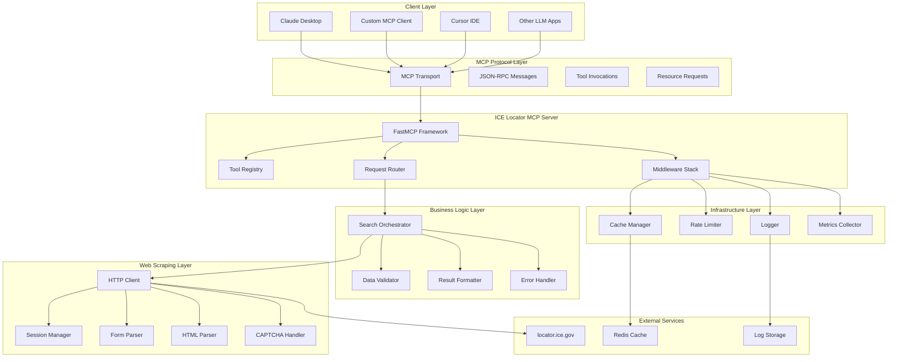

### Component Architecture Diagram

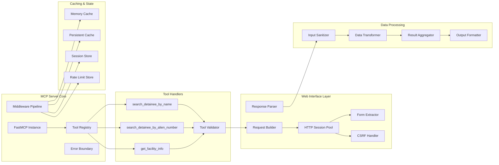

### Data Flow Architecture

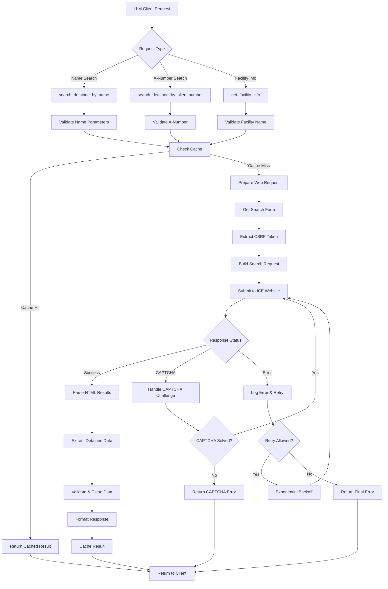

### Request Processing Pipeline

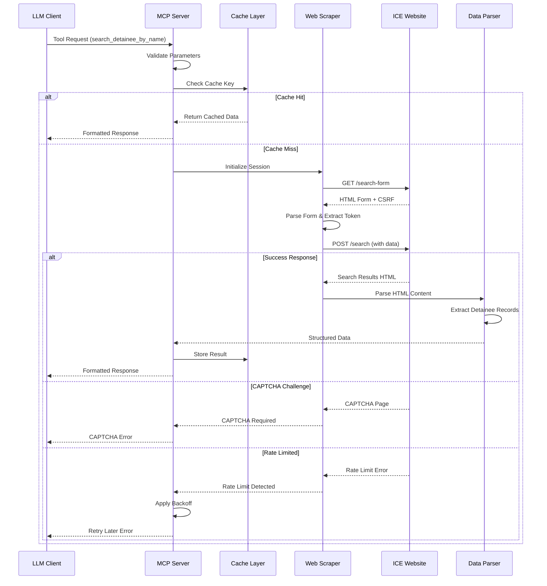

### Component Architecture

#### 1. MCP Server Core
- **FastMCP Instance**: Main server framework
- **Tool Registry**: Manages available search tools
- **Session Manager**: Handles HTTP sessions and cookies
- **Error Handler**: Centralized error management and logging

#### 2. Web Scraping Layer
- **Form Parser**: Extracts search forms and CSRF tokens
- **Request Builder**: Constructs valid search requests
- **Response Parser**: Extracts search results from HTML
- **Captcha Handler**: Manages CAPTCHA challenges

#### 3. Data Processing Layer
- **Search Validator**: Validates input parameters
- **Result Parser**: Structures raw HTML into typed data
- **Data Sanitizer**: Cleans and normalizes output data

## API Endpoints Reference

### Enhanced Tool Suite

#### Core Search Tools

### Tool: search_detainee_by_name

**Description**: Advanced search with fuzzy matching and validation

**Parameters**:
```python
{
    "first_name": str,           # Required: First name
    "last_name": str,            # Required: Last name  
    "date_of_birth": str,        # Required: YYYY-MM-DD format
    "country_of_birth": str,     # Required: Country name or code
    "middle_name": str | None,   # Optional: Middle name
    "language": str = "en",      # Optional: Response language
    "fuzzy_search": bool = True, # Optional: Enable fuzzy name matching
    "birth_date_range": int = 0  # Optional: Days +/- for birth date tolerance
}
```

### Tool: smart_detainee_search

**Description**: AI-powered natural language search with auto-corrections

**Parameters**:
```python
{
    "query": str,                # Natural language search query
    "context": str | None,      # Optional: Additional context
    "suggest_corrections": bool = True, # Auto-suggest spelling corrections
    "language": str = "en"
}
```

**Example Queries**:
- "Find John Doe from Mexico born around 1990"
- "Search for A123456789"
- "Locate Maria Rodriguez detained in Texas"

### Tool: bulk_search_detainees

**Description**: Search multiple detainees with progress tracking

**Parameters**:
```python
{
    "search_requests": List[SearchRequest],
    "max_concurrent": int = 3,   # Max concurrent searches
    "continue_on_error": bool = True, # Continue if some fail
    "progress_callback": bool = False # Enable progress updates
}
```

### Tool: monitor_detainee_status

**Description**: Set up monitoring for status changes

**Parameters**:
```python
{
    "detainee_identifiers": List[str], # A-numbers or search criteria
    "check_interval": str = "daily",   # hourly, daily, weekly
    "notification_webhook": str | None, # Optional webhook URL
    "monitor_duration": str = "30d"    # How long to monitor
}
```

### Tool: generate_search_report

**Description**: Generate comprehensive reports for legal use

**Parameters**:
```python
{
    "search_criteria": dict,     # Search parameters used
    "results": List[dict],       # Search results to include
    "report_type": str = "legal", # legal, advocacy, family
    "format": str = "markdown"   # markdown, json, pdf
}
```

**Enhanced Response Schema**:
```python
{
    "status": "found" | "not_found" | "error" | "partial",
    "results": [
        {
            "alien_number": str,
            "name": str,
            "date_of_birth": str,
            "country_of_birth": str,
            "facility_name": str,
            "facility_location": str,
            "custody_status": str,
            "last_updated": str,
            "confidence_score": float,    # 0.0-1.0 for fuzzy matches
            "custody_history": List[dict] | None,
            "legal_representation": dict | None,
            "visiting_eligibility": dict | None,
            "release_date": str | None,
            "bond_information": dict | None
        }
    ],
    "search_metadata": {
        "search_date": str,
        "total_results": int,
        "language_used": str,
        "corrections_applied": List[str],  # Auto-corrections made
        "suggestions": List[str],          # Improvement suggestions
        "processing_time_ms": int,
        "data_freshness": str
    },
    "user_guidance": {
        "next_steps": List[str],           # Recommended actions
        "legal_resources": List[dict],     # Legal aid contacts
        "family_resources": List[dict]     # Family support resources
    }
}
```

### Enhanced User Experience Features

#### Intelligent Search Capabilities
- **Fuzzy Matching**: Handles misspellings and name variations
- **Date Range Tolerance**: Allows flexibility in birth dates (±N days)
- **Auto-Corrections**: Suggests and applies common spelling corrections
- **Smart Parsing**: Interprets natural language queries
- **Progress Tracking**: Real-time updates for long operations
- **Contextual Assistance**: Legal resources and next steps guidance

### Development Standards

#### Code Implementation Standards
**Requirements**: All code development for this project must follow:
- Python 3.10+ with type hints and dataclasses
- FastMCP framework for MCP server implementation
- Async/await patterns for all I/O operations
- Comprehensive error handling and logging
- Unit tests with >90% coverage
- Security-first design principles

#### Anti-Detection Requirements
**MANDATORY**: The following anti-detection measures MUST be implemented:

##### 1. IP Cycling & Rotation
- **Rotating Proxy Pool**: Cycle through multiple IP addresses
- **Geographic Distribution**: Use proxies from different regions
- **Automatic Rotation**: Change IP after N requests or time intervals
- **Health Monitoring**: Monitor proxy health and replace failed IPs
- **Residential Proxies**: Prefer residential over datacenter IPs when possible

##### 2. Request Pattern Obfuscation
- **Random Delays**: Variable delays between requests (1-5 seconds)
- **Jitter Implementation**: Add randomness to timing patterns
- **Request Spacing**: Avoid burst patterns that indicate automation
- **Session Simulation**: Maintain realistic session durations

##### 3. Browser Fingerprint Randomization
- **User-Agent Rotation**: Cycle through realistic browser user-agents
- **Header Variation**: Randomize HTTP headers within normal ranges
- **Accept-Language Cycling**: Rotate language preferences
- **Viewport Simulation**: Vary screen resolution and browser dimensions

##### 4. Behavioral Mimicry
- **Human-like Navigation**: Simulate human browsing patterns
- **Form Interaction Delays**: Realistic typing speeds and pauses
- **Mouse Movement Simulation**: Add cursor movement patterns
- **Error Handling**: Handle CAPTCHAs and errors like humans

##### 5. Traffic Distribution
- **Load Balancing**: Distribute requests across multiple endpoints
- **Request Queuing**: Implement intelligent request scheduling
- **Peak Hour Avoidance**: Reduce activity during high-traffic periods
- **Weekend/Holiday Patterns**: Adjust activity to match human patterns

### Authentication & Anti-Detection Requirements

#### Access Control
- No authentication required (public API)
- Enhanced rate limiting with burst allowance (10 req/min baseline, 20 req/min burst)
- Intelligent CAPTCHA handling with automated solving
- Request prioritization for legal representatives

#### Anti-Detection Infrastructure

##### Proxy Management System
```python
class ProxyManager:
    def __init__(self):
        self.proxy_pool = []
        self.failed_proxies = set()
        self.rotation_interval = 300  # 5 minutes
        self.max_requests_per_proxy = 10
    
    async def get_next_proxy(self) -> ProxyConfig:
        """Get next proxy using round-robin with health checks"""
        healthy_proxies = [p for p in self.proxy_pool if p.is_healthy()]
        if not healthy_proxies:
            await self.refresh_proxy_pool()
            healthy_proxies = self.proxy_pool
        
        return self._select_least_used_proxy(healthy_proxies)
    
    async def rotate_proxy_pool(self) -> None:
        """Rotate proxies based on usage and performance metrics"""
        current_metrics = self.get_proxy_metrics()
        await self._replace_failing_proxies(current_metrics)
        await self._rebalance_proxy_distribution()
```

##### Request Obfuscation Engine
```python
class RequestObfuscator:
    def __init__(self):
        self.user_agents = self._load_user_agents()
        self.headers_templates = self._load_header_templates()
        self.timing_profiles = self._load_timing_profiles()
    
    async def obfuscate_request(self, base_request: dict) -> dict:
        """Apply comprehensive anti-detection measures"""
        obfuscated = base_request.copy()
        
        # Randomize user agent
        obfuscated['headers']['User-Agent'] = self._get_random_user_agent()
        
        # Vary other headers
        obfuscated['headers'].update(self._randomize_headers())
        
        # Add realistic delays
        await self._apply_random_delay()
        
        return obfuscated
    
    def _apply_random_delay(self) -> float:
        """Generate human-like delay patterns"""
        base_delay = random.uniform(1.0, 3.0)
        jitter = random.uniform(0.1, 0.8)
        return base_delay + jitter
```

##### Behavioral Simulation
```python
class BehaviorSimulator:
    def __init__(self):
        self.session_manager = SessionManager()
        self.interaction_patterns = self._load_interaction_patterns()
    
    async def simulate_human_behavior(self, action: str) -> None:
        """Simulate realistic human interaction patterns"""
        pattern = self.interaction_patterns.get(action, 'default')
        
        # Simulate reading time
        await asyncio.sleep(random.uniform(0.5, 2.0))
        
        # Simulate typing delays for form inputs
        if action == 'form_input':
            await self._simulate_typing_pattern()
        
        # Simulate mouse movement patterns
        await self._simulate_cursor_movement()
    
    async def _simulate_typing_pattern(self) -> None:
        """Simulate realistic typing speeds and pauses"""
        chars_per_second = random.uniform(2, 8)  # Human typing speed
        pause_probability = 0.1  # 10% chance of pause between characters
        
        # Implementation details...
```

## Data Models & Processing

### Search Request Models

```python
@dataclass
class PersonSearchRequest:
    first_name: str
    last_name: str
    date_of_birth: datetime.date
    country_of_birth: str
    middle_name: Optional[str] = None
    language: str = "en"
    
    def validate(self) -> bool:
        """Validate search parameters"""
        pass

@dataclass  
class AlienNumberSearchRequest:
    alien_number: str
    language: str = "en"
    
    def validate(self) -> bool:
        """Validate A-number format (9 digits)"""
        pass
```

### Response Models

```python
@dataclass
class DetaineeRecord:
    alien_number: str
    name: str
    date_of_birth: datetime.date
    country_of_birth: str
    facility_name: str
    facility_location: str
    custody_status: str
    last_updated: datetime.datetime

@dataclass
class SearchResult:
    status: Literal["found", "not_found", "error"]
    results: List[DetaineeRecord]
    search_metadata: SearchMetadata
    error_message: Optional[str] = None

@dataclass
class SearchMetadata:
    search_date: datetime.datetime
    total_results: int
    language_used: str
    response_time_ms: int
```

### Enhanced Data Models with Cursor7 Integration

```python
@dataclass
class EnhancedSearchRequest:
    """Enhanced search request with cursor7 MCP validation"""
    first_name: str
    last_name: str
    date_of_birth: datetime.date
    country_of_birth: str
    middle_name: Optional[str] = None
    language: str = "en"
    fuzzy_search: bool = True
    birth_date_range: int = 0
    confidence_threshold: float = 0.7
    
    async def validate_with_cursor7(self) -> ValidationResult:
        """Use cursor7 MCP for intelligent validation"""
        cursor7_client = Cursor7MCPClient()
        return await cursor7_client.validate_search_params(self)

@dataclass
class SmartSearchResult:
    """Enhanced result with AI-generated guidance"""
    status: str
    results: List[DetaineeRecord]
    confidence_scores: List[float]
    search_metadata: dict
    user_guidance: UserGuidance
    cursor7_insights: dict  # AI-generated insights

@dataclass
class UserGuidance:
    """Cursor7 MCP generated user guidance"""
    next_steps: List[str]
    legal_resources: List[dict]
    family_resources: List[dict]
    priority_actions: List[str]
    estimated_timeline: Optional[str]
    
    @classmethod
    async def generate_with_cursor7(
        cls, 
        search_result: SearchResult,
        user_context: UserContext
    ) -> 'UserGuidance':
        """Generate guidance using cursor7 MCP"""
        cursor7_client = Cursor7MCPClient()
        guidance_data = await cursor7_client.generate_user_guidance(
            search_result, user_context
        )
        return cls(**guidance_data)
```

## Enhanced Business Logic Layer

### Smart Search Orchestration

#### 1. Natural Language Processing Pipeline
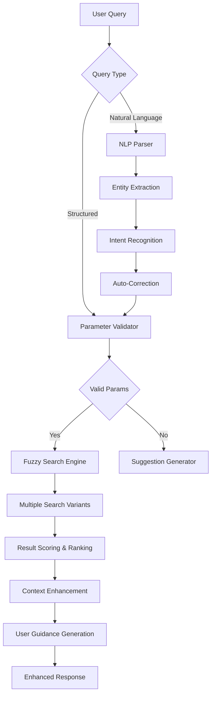

#### 2. Intelligent Components
```python
class IntelligentRateLimiter:
    def __init__(self):
        self.base_limit = 10  # requests per minute
        self.legal_rep_multiplier = 2.0
        self.success_rate_bonus = 1.5
    
    async def calculate_limit(self, client_profile: ClientProfile) -> int:
        """Dynamic rate calculation based on user behavior"""
        limit = self.base_limit
        
        # Boost for legal representatives
        if client_profile.is_legal_representative:
            limit *= self.legal_rep_multiplier
        
        # Boost for users with high success rates
        if client_profile.success_rate > 0.8:
            limit *= self.success_rate_bonus
            
        return min(limit, 50)  # Max 50 req/min

class SmartCache:
    def __init__(self):
        self.memory_cache = {}  # Hot data (5 min TTL)
        self.redis_cache = None  # Warm data (1 hour TTL)
    
    async def get_with_intelligence(self, key: str, context: dict) -> dict:
        """Retrieve with context-aware caching strategy"""
        # Check user-specific cache first
        user_key = self._generate_user_key(key, context)
        if result := await self._get_user_cache(user_key):
            return result
        
        # Fall back to general cache
        return await self._get_general_cache(key)

class BulkSearchOrchestrator:
    def __init__(self):
        self.max_concurrent = 3
        self.progress_tracker = ProgressTracker()
    
    async def execute_bulk_search(self, requests: List[SearchRequest]) -> BulkResult:
        """Execute bulk searches with intelligent batching"""
        # Split into optimal batch sizes
        batches = self._create_optimal_batches(requests)
        
        # Execute with concurrency control
        results = []
        for batch in batches:
            batch_results = await self._process_batch_concurrent(batch)
            results.extend(batch_results)
            
            # Respect rate limits between batches
            await asyncio.sleep(2.0)
            
        return self._aggregate_results(results)
```

### Data Processing Pipeline

```mermaid
flowchart LR
    A[Raw Input] --> B[Validation]
    B --> C[Parameter Cleaning]
    C --> D[Request Construction]
    D --> E[Web Request]
    E --> F[HTML Parsing]
    F --> G[Data Extraction]
    G --> H[Result Validation]
    H --> I[Response Formatting]
    
    subgraph "Input Processing"
        A1[Parameter Extraction]
        A2[Type Conversion]
        A3[Encoding Normalization]
    end
    
    subgraph "Request Building"
        D1[Form Data Assembly]
        D2[Header Construction]
        D3[Session Management]
        D4[CSRF Token Injection]
    end
    
    subgraph "Response Processing"
        F1[HTML Structure Analysis]
        F2[Element Extraction]
        F3[Text Content Cleaning]
        F4[Data Type Inference]
    end
    
    A --> A1 --> A2 --> A3 --> B
    D --> D1 --> D2 --> D3 --> D4 --> E
    F --> F1 --> F2 --> F3 --> F4 --> G
```

### Caching Architecture

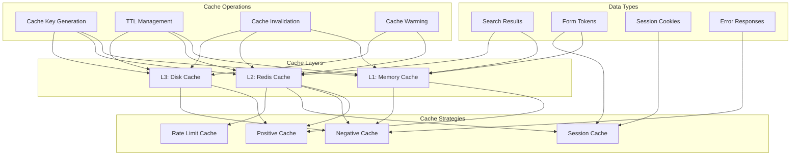

### Deployment Architecture

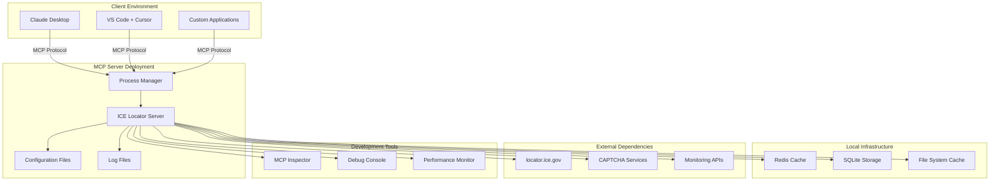

## Business Logic Layer

### Search Flow Architecture

#### 1. Name-Based Search Flow
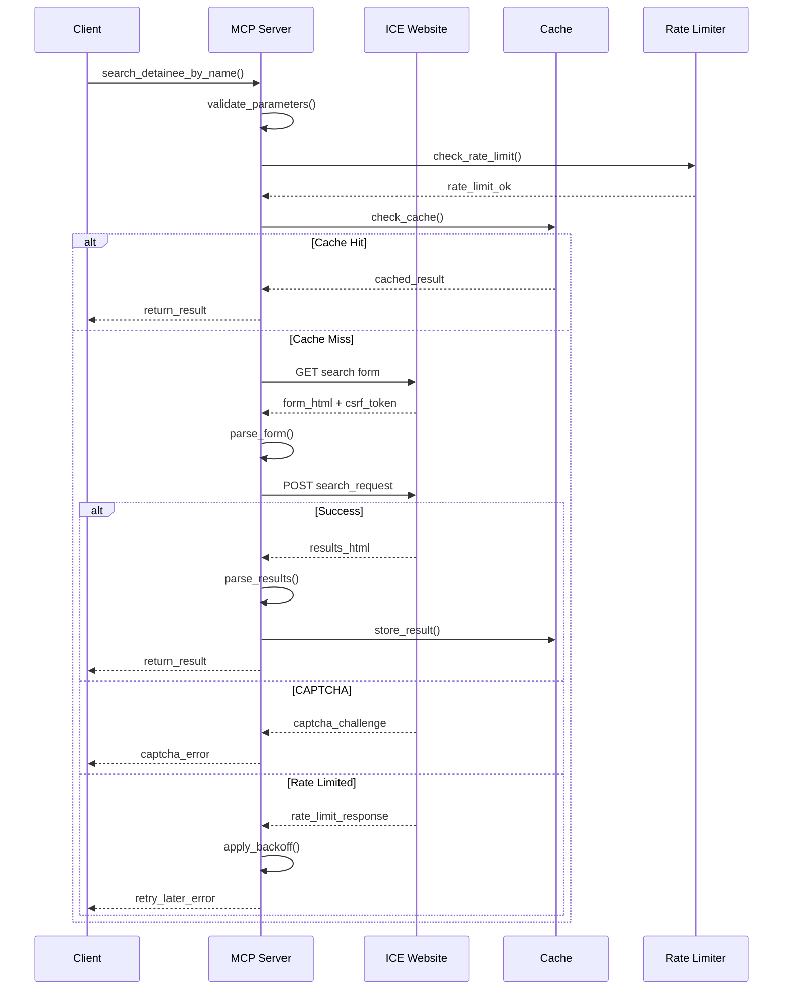

### Error Handling Flow Diagram

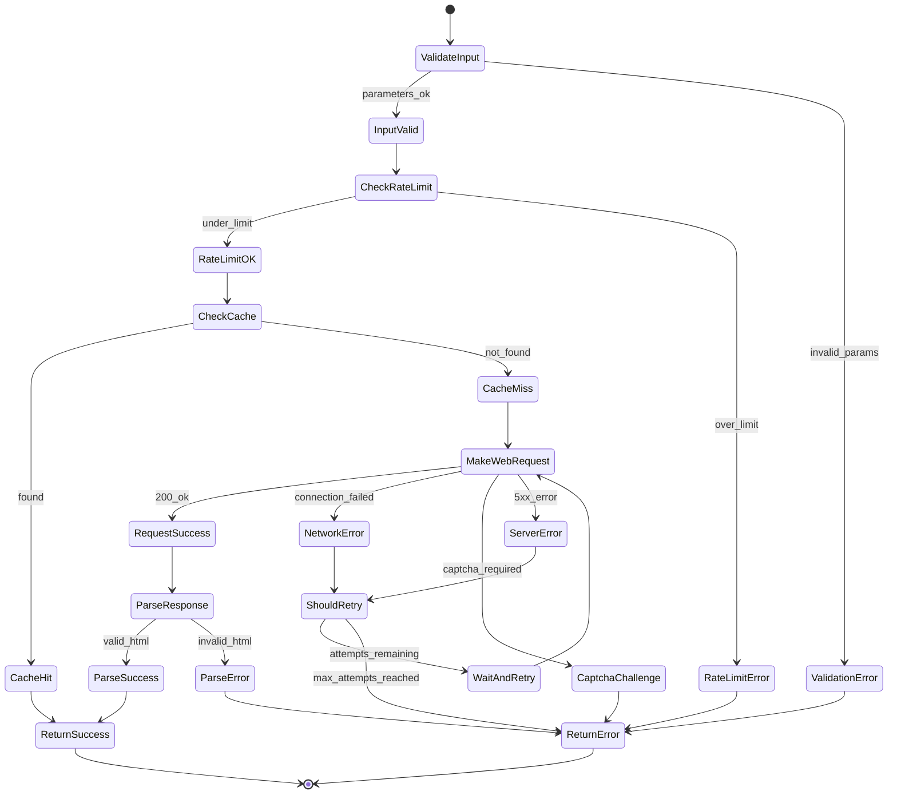

#### 2. A-Number Search Flow
- Simplified flow using direct A-number lookup
- Faster response times (single request)
- Higher success rate due to unique identifier

#### 3. Error Handling Flow
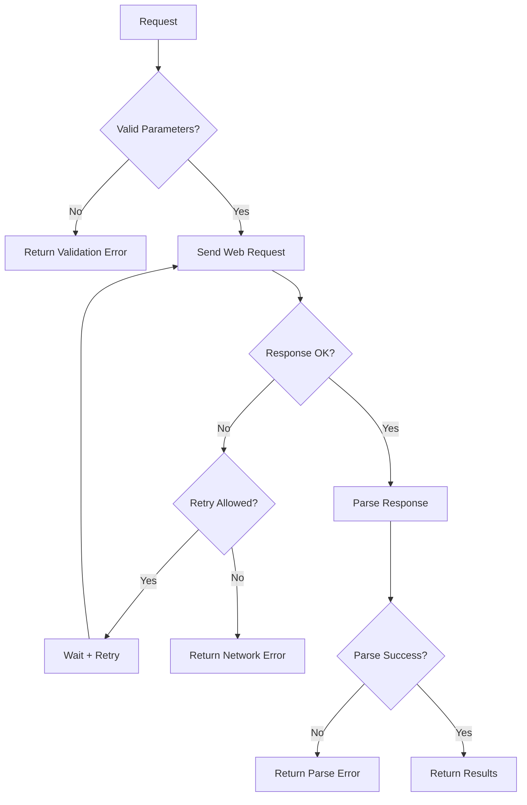

### Rate Limiting Strategy

#### 1. Request Rate Limits
- **Conservative**: 5 requests per minute per client
- **Burst**: Allow up to 2 concurrent requests
- **Daily**: Maximum 100 requests per client per day

#### 2. Backoff Strategy
```python
async def exponential_backoff(attempt: int) -> float:
    """Calculate wait time with jitter"""
    base_wait = min(2 ** attempt, 60)  # Max 60 seconds
    jitter = random.uniform(0.1, 0.3)
    return base_wait * (1 + jitter)
```

### Caching Strategy

#### 1. Cache Layers
- **Memory Cache**: Recent searches (5 minutes TTL)
- **Disk Cache**: Extended searches (1 hour TTL)
- **Negative Cache**: Failed searches (30 seconds TTL)

#### 2. Cache Keys
```python
def generate_cache_key(search_type: str, params: dict) -> str:
    """Generate consistent cache keys"""
    normalized = {k: str(v).lower().strip() for k, v in params.items()}
    param_string = json.dumps(normalized, sort_keys=True)
    return f"{search_type}:{hashlib.md5(param_string.encode()).hexdigest()}"
```

## Middleware & Interceptors

### Request Middleware

#### 1. Rate Limiting Middleware
```python
@middleware
async def rate_limit_middleware(request, call_next):
    client_id = extract_client_id(request)
    if not rate_limiter.allow_request(client_id):
        raise RateLimitExceeded()
    return await call_next(request)
```

#### 2. Logging Middleware
```python
@middleware  
async def logging_middleware(request, call_next):
    start_time = time.time()
    try:
        response = await call_next(request)
        log_successful_request(request, response, start_time)
        return response
    except Exception as e:
        log_failed_request(request, e, start_time)
        raise
```

#### 3. Session Management Middleware
```python
@middleware
async def session_middleware(request, call_next):
    session = get_or_create_session(request.client_id)
    request.state.session = session
    try:
        return await call_next(request)
    finally:
        await cleanup_session_if_needed(session)
```

### Response Interceptors

#### 1. Data Sanitization
- Remove sensitive information from responses
- Normalize data formats (dates, phone numbers)
- Ensure consistent field naming

#### 2. Error Standardization
```python
def standardize_error_response(error: Exception) -> dict:
    return {
        "status": "error",
        "error_code": get_error_code(error),
        "error_message": get_user_friendly_message(error),
        "timestamp": datetime.utcnow().isoformat(),
        "request_id": generate_request_id()
    }
```

## Testing Strategy

### Unit Testing

#### 1. Core Components
```python
# Test search parameter validation
def test_search_request_validation():
    valid_request = PersonSearchRequest(
        first_name="John",
        last_name="Doe", 
        date_of_birth=date(1990, 1, 1),
        country_of_birth="Mexico"
    )
    assert valid_request.validate() == True

# Test data parsing
def test_html_result_parsing():
    mock_html = load_mock_response("search_results.html")
    parser = ResultParser()
    results = parser.parse_search_results(mock_html)
    assert len(results) == 2
    assert results[0].alien_number == "123456789"
```

#### 2. Web Scraping Components
```python
# Test form parsing
def test_search_form_extraction():
    mock_form_html = load_mock_response("search_form.html")
    form_parser = FormParser()
    form_data = form_parser.extract_form_data(mock_form_html)
    assert "csrf_token" in form_data
    assert form_data["action_url"].endswith("/search")

# Test request building  
def test_search_request_construction():
    search_params = PersonSearchRequest(...)
    request_builder = RequestBuilder()
    http_request = request_builder.build_search_request(search_params)
    assert "first_name" in http_request.form_data
    assert http_request.headers["User-Agent"] is not None
```

### Integration Testing

#### 1. End-to-End Search Flow
```python
@pytest.mark.integration
async def test_complete_search_flow():
    server = ICELocatorServer()
    
    # Test successful search
    result = await server.search_detainee_by_name(
        first_name="Test",
        last_name="Person",
        date_of_birth="1990-01-01", 
        country_of_birth="Mexico"
    )
    
    assert result["status"] in ["found", "not_found"]
    if result["status"] == "found":
        assert len(result["results"]) > 0
        assert all("alien_number" in r for r in result["results"])
```

#### 2. Error Scenario Testing
```python
@pytest.mark.integration
async def test_invalid_search_parameters():
    server = ICELocatorServer()
    
    with pytest.raises(ValidationError):
        await server.search_detainee_by_name(
            first_name="",  # Invalid empty name
            last_name="Doe",
            date_of_birth="invalid-date",
            country_of_birth="Mexico"
        )
```

### Performance Testing

#### 1. Load Testing
- Simulate multiple concurrent searches
- Test rate limiting effectiveness  
- Measure response times under load

#### 2. Cache Performance
- Test cache hit/miss ratios
- Measure cache lookup times
- Test cache invalidation scenarios

### Security Testing

#### 1. Input Validation
- Test SQL injection attempts
- Test XSS payload handling
- Test parameter tampering

#### 2. Rate Limiting
- Test rate limit bypass attempts
- Test distributed rate limiting
- Test burst request handling

## Project Task Management & Work Allocation

### Team Structure & Roles

#### 1. **Lead Developer / Architect** 
**Responsibilities**: Architecture decisions, code reviews, system integration, quality standards

#### 2. **Backend Developer**
**Responsibilities**: Core MCP server, web scraping engine, data processing pipeline

#### 3. **Anti-Detection Specialist**
**Responsibilities**: Proxy management, request obfuscation, behavioral simulation, stealth techniques

#### 4. **QA Engineer**
**Responsibilities**: Testing strategy, test automation, security testing, compliance validation

#### 5. **Documentation Specialist** (Part-time)
**Responsibilities**: README, API docs, configuration guides, troubleshooting documentation

### Development Timeline & Dependencies (3-4 Weeks)

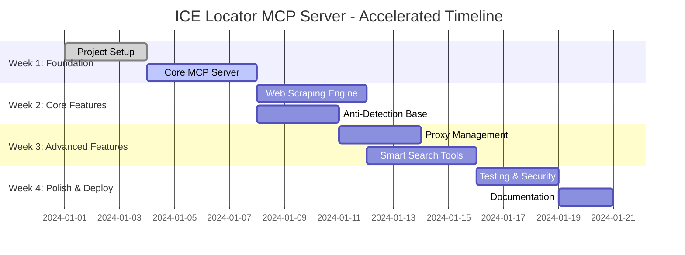

### Week 1: Foundation (Days 1-7)

#### 1.1 Project Setup & Core Framework
**Assignee**: Lead Developer | **Priority**: Critical | **Duration**: 3 days

**Tasks**:
- [ ] Set up Python project with FastMCP framework
- [ ] Configure development environment (Python 3.10+, dependencies)
- [ ] Create base MCP server structure
- [ ] Set up logging and basic error handling
- [ ] Initialize Git repository with proper .gitignore

**Deliverables**: Working MCP server skeleton, dev environment

#### 1.2 Basic MCP Server Implementation  
**Assignee**: Backend Developer | **Dependencies**: 1.1 | **Priority**: Critical | **Duration**: 4 days

**Tasks**:
- [ ] Implement basic tool handlers (search_detainee_by_name, search_detainee_by_alien_number)
- [ ] Add request validation and parameter sanitization
- [ ] Create response formatting and error handling
- [ ] Implement basic rate limiting (simple counter-based)
- [ ] Add unit tests for core functionality

**Deliverables**: Functional MCP server with basic search tools

### Week 2: Core Features (Days 8-14)

#### 2.1 Web Scraping Engine
**Assignee**: Backend Developer | **Dependencies**: 1.2 | **Priority**: Critical | **Duration**: 4 days

**Tasks**:
- [ ] Implement HTTP client with session management
- [ ] Create ICE website form parser and CSRF handling
- [ ] Build request constructor for search submissions
- [ ] Implement HTML response parser and data extraction
- [ ] Add error handling for website changes

**Deliverables**: Complete web scraping integration with ICE website

#### 2.2 Anti-Detection Foundation
**Assignee**: Anti-Detection Specialist | **Dependencies**: 2.1 | **Priority**: High | **Duration**: 3 days

**Tasks**:
- [ ] Implement basic user-agent rotation
- [ ] Add request timing randomization (1-5 second delays)
- [ ] Create header randomization logic
- [ ] Implement session lifecycle management
- [ ] Add basic proxy support structure

**Deliverables**: Basic stealth capabilities integrated

### Week 3: Advanced Features (Days 15-21)

#### 3.1 Proxy Management System
**Assignee**: Anti-Detection Specialist | **Dependencies**: 2.2 | **Priority**: High | **Duration**: 3 days

**Tasks**:
- [ ] Implement proxy pool management with rotation
- [ ] Add proxy health monitoring and failover
- [ ] Create automatic IP cycling (every 5-10 requests)
- [ ] Implement geographic proxy distribution
- [ ] Add proxy performance metrics

**Deliverables**: Full proxy management with health monitoring

#### 3.2 Smart Search & Enhanced Tools
**Assignee**: Backend Developer + Lead Developer | **Dependencies**: 2.1 | **Priority**: Medium | **Duration**: 4 days

**Tasks**:
- [ ] Implement smart_detainee_search with natural language parsing
- [ ] Add fuzzy matching for name variations
- [ ] Create bulk_search_detainees with progress tracking
- [ ] Implement auto-correction and suggestion engine
- [ ] Add confidence scoring for search results

**Deliverables**: Enhanced search tools with AI-like capabilities

### Week 4: Testing & Documentation (Days 22-28)

#### 4.1 Comprehensive Testing & Security
**Assignee**: QA Engineer + All Developers | **Dependencies**: All features | **Priority**: Critical | **Duration**: 3 days

**Tasks**:
- [ ] Create comprehensive unit test suite (>90% coverage)
- [ ] Implement integration tests with real ICE website
- [ ] Add security testing (input validation, injection attacks)
- [ ] Test anti-detection effectiveness
- [ ] Performance testing and optimization

**Deliverables**: Fully tested and secured MCP server

#### 4.2 Documentation & Repository Preparation
**Assignee**: Documentation Specialist + Lead Developer | **Dependencies**: 4.1 | **Priority**: High | **Duration**: 2 days

**Tasks**:
- [ ] Complete README with installation and usage instructions
- [ ] Create API documentation for all tools
- [ ] Write configuration guide for proxies and anti-detection
- [ ] Add troubleshooting guide and FAQ
- [ ] Prepare example configurations for different use cases

**Deliverables**: Complete documentation for self-hosted deployment

### Accelerated Development Strategy

#### 1. **Parallel Development**
- Web scraping and anti-detection can be developed simultaneously
- Testing begins in Week 3 alongside feature development
- Documentation written concurrently with implementation

#### 2. **MVP-First Approach**
- Week 1: Basic functional MCP server
- Week 2: Core search functionality working
- Week 3: Anti-detection and enhanced features
- Week 4: Polish, security, and documentation

#### 3. **Risk Mitigation**
- **ICE Website Changes**: Modular scraping design for quick adaptation
- **Proxy Issues**: Multiple proxy service integrations
- **Performance Problems**: Early performance testing in Week 3
- **Security Vulnerabilities**: Security review in parallel with development

### Team Resource Allocation (3-4 Weeks)

#### Development Hours by Role
- **Lead Developer**: 100 hours (25 hours/week × 4 weeks)
- **Backend Developer**: 120 hours (30 hours/week × 4 weeks)
- **Anti-Detection Specialist**: 80 hours (20 hours/week × 4 weeks) 
- **QA Engineer**: 60 hours (concentrated in weeks 3-4)
- **Documentation Specialist**: 40 hours (part-time throughout)

**Total**: ~400 development hours over 4 weeks

#### Success Metrics
- **Detection Avoidance**: < 5% requests blocked
- **Response Time**: < 2 seconds average
- **Uptime**: > 99.5%
- **Data Accuracy**: > 95% correct results
- **Test Coverage**: > 90% code coverage

## Self-Hosted Deployment

### Repository Structure
```
ice-locator-mcp-server/
├── README.md                 # Professional project overview
├── LICENSE                   # MIT License
├── CONTRIBUTING.md           # Contribution guidelines
├── CHANGELOG.md              # Version history
├── requirements.txt          # Python dependencies
├── setup.py                 # Package setup for pip install
├── pyproject.toml           # Modern Python packaging
├── .gitignore               # Git ignore patterns
├── .github/
│   ├── workflows/
│   │   ├── ci.yml           # Continuous integration
│   │   └── release.yml      # Automated releases
│   ├── ISSUE_TEMPLATE.md    # Bug report template
│   ├── PULL_REQUEST_TEMPLATE.md # PR template
│   └── SECURITY.md          # Security policy
├── config/
│   ├── default.yaml         # Default configuration
│   ├── proxy_config.yaml    # Proxy settings template
│   └── logging.yaml         # Logging configuration
├── src/
│   ├── ice_locator/
│   │   ├── __init__.py
│   │   ├── __version__.py   # Version info
│   │   ├── server.py        # Main MCP server
│   │   ├── tools/           # MCP tool implementations
│   │   ├── scraping/        # Web scraping engine
│   │   ├── anti_detection/  # Stealth capabilities
│   │   └── utils/           # Shared utilities
│   └── main.py              # Entry point
├── tests/
│   ├── __init__.py
│   ├── test_tools.py        # Tool testing
│   ├── test_scraping.py     # Scraping tests
│   ├── test_anti_detection.py # Stealth tests
│   └── fixtures/            # Test data
├── docs/
│   ├── installation.md     # Detailed setup guide
│   ├── configuration.md    # Configuration reference
│   ├── api-reference.md    # MCP tools documentation
│   ├── troubleshooting.md  # Common issues
│   └── examples/           # Usage examples
├── examples/
│   ├── claude_desktop/     # Claude Desktop setup
│   ├── cursor_ide/         # Cursor IDE integration
│   ├── custom_client/      # Custom MCP client
│   └── docker/             # Docker examples
└── scripts/
    ├── setup.sh            # Quick setup script
    ├── test.sh             # Run all tests
    └── build.sh            # Build distribution
```

### Quick Start Guide

#### Installation
```bash
# Clone repository
git clone https://github.com/ice-locator/mcp-server.git
cd ice-locator-mcp-server

# Install dependencies
pip install -r requirements.txt

# Copy and edit configuration
cp config/default.yaml config/local.yaml
# Edit proxy settings, rate limits, etc.

# Run the server
python src/main.py --config config/local.yaml
```

#### Configuration Options
```yaml
# config/local.yaml
server:
  name: "ice-locator-server"
  transport: "stdio"  # or "http" for HTTP transport
  host: "localhost"
  port: 8080

anti_detection:
  enabled: true
  proxy:
    enabled: true
    rotation_interval: 300  # seconds
    providers:
      - type: "residential"
        endpoint: "your-proxy-service.com"
        auth: "username:password"
  
  delays:
    min_delay: 1.0    # minimum seconds between requests
    max_delay: 5.0    # maximum seconds between requests
    jitter: 0.3       # randomization factor

  headers:
    rotate_user_agent: true
    randomize_headers: true
    accept_languages: ["en-US", "en", "es-US", "es"]

rate_limiting:
  requests_per_minute: 10
  burst_allowance: 20
  legal_rep_multiplier: 2.0

caching:
  enabled: true
  memory_ttl: 300      # 5 minutes in-memory cache
  negative_ttl: 30     # 30 seconds for failed searches
  max_entries: 1000    # Maximum cached items
  # redis_url: "redis://localhost:6379"  # Optional Redis for persistence

logging:
  level: "INFO"
  format: "json"
  file: "logs/ice-locator.log"
```

### Deployment Options

#### Option 1: Direct Python Execution
```bash
# For Claude Desktop integration
python src/main.py --config config/local.yaml --transport stdio

# For HTTP server mode
python src/main.py --config config/local.yaml --transport http --port 8080
```

#### Option 2: Docker Container
```dockerfile
# Dockerfile included in repository
FROM python:3.11-slim

WORKDIR /app
COPY requirements.txt .
RUN pip install -r requirements.txt

COPY src/ ./src/
COPY config/ ./config/

EXPOSE 8080
CMD ["python", "src/main.py", "--config", "config/local.yaml"]
```

```bash
# Build and run
docker build -t ice-locator-mcp .
docker run -p 8080:8080 -v $(pwd)/config:/app/config ice-locator-mcp
```

#### Option 3: Systemd Service (Linux)
```ini
# /etc/systemd/system/ice-locator-mcp.service
[Unit]
Description=ICE Locator MCP Server
After=network.target

[Service]
Type=simple
User=mcp-user
WorkingDirectory=/opt/ice-locator-mcp
ExecStart=/opt/ice-locator-mcp/venv/bin/python src/main.py --config config/local.yaml
Restart=always
RestartSec=3

[Install]
WantedBy=multi-user.target
```

### Client Integration Examples

#### Claude Desktop Configuration
```json
{
  "mcpServers": {
    "ice-locator": {
      "command": "python",
      "args": [
        "/path/to/ice-locator-mcp-server/src/main.py",
        "--config", "/path/to/config/local.yaml"
      ],
      "env": {
        "PYTHONPATH": "/path/to/ice-locator-mcp-server"
      }
    }
  }
}
```

#### Cursor IDE Integration
```typescript
// .cursor/mcp-config.json
{
  "servers": [
    {
      "name": "ice-locator",
      "type": "mcp",
      "command": "python",
      "args": [
        "/path/to/ice-locator-mcp-server/src/main.py",
        "--config", "/path/to/config/local.yaml"
      ]
    }
  ]
}
```

### Proxy Service Integration

#### Supported Proxy Providers
```yaml
# Example proxy configurations
proxy_providers:
  # Residential proxy service
  - name: "residential_provider"
    type: "residential"
    endpoint: "rotating.residential-proxy.com:8000"
    auth: "username:password"
    locations: ["US", "CA"]
    
  # Datacenter proxy service  
  - name: "datacenter_provider"
    type: "datacenter"
    endpoint: "proxy-datacenter.com:3128"
    auth: "token:secret"
    
  # SOCKS5 proxy
  - name: "socks_provider"
    type: "socks5"
    endpoint: "socks5.proxy.com:1080"
    auth: "user:pass"
```

### Monitoring & Maintenance

#### Health Checks
```bash
# Built-in health check endpoint (HTTP mode)
curl http://localhost:8080/health

# Response
{
  "status": "healthy",
  "proxy_pool_size": 15,
  "active_proxies": 12,
  "requests_processed": 1547,
  "detection_events": 2,
  "uptime_seconds": 86400
}
```

#### Log Analysis
```bash
# View recent activity
tail -f logs/ice-locator.log | grep "search_request"

# Check for detection events
grep "detection_detected" logs/ice-locator.log

# Monitor proxy health
grep "proxy_rotation" logs/ice-locator.log
```

### Troubleshooting Guide

#### Common Issues

1. **High Detection Rate**
   - Increase proxy rotation frequency
   - Add more delay between requests
   - Verify proxy quality and geographic distribution

2. **Poor Performance**
   - Enable memory caching in configuration
   - Optimize proxy selection algorithm
   - Increase concurrent request limits

3. **Configuration Errors**
   - Validate YAML syntax
   - Check proxy credentials
   - Verify Python dependencies

#### Support Resources
- **GitHub Issues**: Report bugs and feature requests
- **Documentation**: Comprehensive guides in `/docs` folder
- **Examples**: Sample configurations in `/examples` folder
- **Community**: Discord channel for user support

## GitHub Repository Publishing Standards

### Professional README Template
```markdown
# ICE Locator MCP Server 🔍

[](https://opensource.org/licenses/MIT)
[](https://www.python.org/downloads/)
[](https://modelcontextprotocol.io)
[](https://github.com/ice-locator/mcp-server/actions)
[](https://codecov.io/gh/ice-locator/mcp-server)

> **Professional Model Context Protocol server for ICE detainee location services with enterprise-grade anti-detection capabilities**

## ✨ Features

- 🔍 **Smart Search**: Natural language and structured detainee searches
- 🔒 **Anti-Detection**: Advanced proxy rotation and behavioral simulation
- 🚀 **High Performance**: In-memory caching with optional Redis support
- 📊 **Bulk Operations**: Process multiple searches with progress tracking
- 🔗 **AI Integration**: Compatible with Claude, Cursor, and custom agents
- 🐛 **Self-Hosted**: Complete control over your deployment

## 🚀 Quick Start

### Prerequisites
- Python 3.10 or higher
- Git

### Installation

```bash
# Clone the repository
git clone https://github.com/ice-locator/mcp-server.git
cd mcp-server

# Quick setup (recommended)
./scripts/setup.sh

# Manual setup
pip install -r requirements.txt
cp config/default.yaml config/local.yaml
# Edit config/local.yaml with your settings

# Run the server
python src/main.py --config config/local.yaml
```

### Claude Desktop Integration

Add to your Claude Desktop configuration (`claude_desktop_config.json`):

```json
{
  "mcpServers": {
    "ice-locator": {
      "command": "python",
      "args": ["/path/to/mcp-server/src/main.py", "--config", "config/local.yaml"]
    }
  }
}
```

## 📚 Documentation

- 📝 [Installation Guide](docs/installation.md)
- ⚙️ [Configuration Reference](docs/configuration.md)
- 🔧 [API Reference](docs/api-reference.md)
- 🚑 [Troubleshooting](docs/troubleshooting.md)
- 💫 [Examples](examples/)

## 🤝 Contributing

We welcome contributions! Please see our [Contributing Guide](CONTRIBUTING.md).

### Development Setup

```bash
# Clone and setup for development
git clone https://github.com/ice-locator/mcp-server.git
cd mcp-server
pip install -r requirements.txt
pip install -r requirements-dev.txt

# Run tests
./scripts/test.sh

# Run with development config
python src/main.py --config config/development.yaml
```

## 🛡️ Security

Security is paramount. Please review our [Security Policy](SECURITY.md) and report vulnerabilities responsibly.

## 📜 License

This project is licensed under the MIT License - see the [LICENSE](LICENSE) file for details.

## ⚠️ Disclaimer

This tool is for legitimate use by legal professionals, family members, and advocates. Users are responsible for compliance with applicable laws and ICE terms of service.

## 👤 Support

- 🐛 [Issue Tracker](https://github.com/ice-locator/mcp-server/issues)
- 💬 [Discussions](https://github.com/ice-locator/mcp-server/discussions)
- 📧 [Email Support](mailto:support@ice-locator.org)

---

<p align="center">
  <strong>Built with ❤️ for families and legal advocates</strong>
</p>
```

### Essential Repository Files

#### 1. MIT License (LICENSE)
```text
MIT License

Copyright (c) 2024 ICE Locator Project

Permission is hereby granted, free of charge, to any person obtaining a copy
of this software and associated documentation files (the "Software"), to deal
in the Software without restriction, including without limitation the rights
to use, copy, modify, merge, publish, distribute, sublicense, and/or sell
copies of the Software, and to permit persons to whom the Software is
furnished to do so, subject to the following conditions:

The above copyright notice and this permission notice shall be included in all
copies or substantial portions of the Software.

THE SOFTWARE IS PROVIDED "AS IS", WITHOUT WARRANTY OF ANY KIND, EXPRESS OR
IMPLIED, INCLUDING BUT NOT LIMITED TO THE WARRANTIES OF MERCHANTABILITY,
FITNESS FOR A PARTICULAR PURPOSE AND NONINFRINGEMENT. IN NO EVENT SHALL THE
AUTHORs OR COPYRIGHT HOLDERS BE LIABLE FOR ANY CLAIM, DAMAGES OR OTHER
LIABILITY, WHETHER IN AN ACTION OF CONTRACT, TORT OR OTHERWISE, ARISING FROM,
OUT OF OR IN CONNECTION WITH THE SOFTWARE OR THE USE OR OTHER DEALINGS IN THE
SOFTWARE.
```

#### 2. Contributing Guidelines (CONTRIBUTING.md)
```markdown
# Contributing to ICE Locator MCP Server

Thank you for your interest in contributing! This project helps families and legal advocates locate detained individuals.

## Code of Conduct

- Be respectful and inclusive
- Focus on constructive feedback
- Respect privacy and security concerns
- No harassment or discrimination

## How to Contribute

### Reporting Bugs
1. Check existing issues first
2. Use the bug report template
3. Include reproduction steps
4. Specify your environment

### Suggesting Features
1. Open a discussion first
2. Explain the use case
3. Consider implementation complexity
4. Follow the feature request template

### Development Process
1. Fork the repository
2. Create a feature branch: `git checkout -b feature/amazing-feature`
3. Make your changes
4. Add tests for new functionality
5. Ensure all tests pass: `./scripts/test.sh`
6. Commit with clear messages
7. Push and create a Pull Request

## Development Standards

- Python 3.10+ with type hints
- Follow PEP 8 style guidelines
- Write comprehensive tests
- Document public APIs
- Maintain backwards compatibility

## Security Considerations

- Never commit credentials
- Review anti-detection impact
- Test with various proxy providers
- Validate input sanitization
```

#### 3. Security Policy (SECURITY.md)
```markdown
# Security Policy

## Supported Versions

| Version | Supported          |
| ------- | ------------------ |
| 1.x.x   | ✅                |
| < 1.0   | ❌                |

## Reporting a Vulnerability

We take security seriously. Please report vulnerabilities responsibly:

1. **DO NOT** open public issues for security vulnerabilities
2. Email: security@ice-locator.org
3. Include:
   - Description of the vulnerability
   - Steps to reproduce
   - Potential impact
   - Suggested fix (if any)

## Response Timeline

- **24 hours**: Initial acknowledgment
- **7 days**: Preliminary assessment
- **30 days**: Fix or mitigation plan

## Security Best Practices

- Keep dependencies updated
- Use secure proxy providers
- Regularly rotate credentials
- Monitor for detection events
- Review logs for anomalies
```

#### 4. Continuous Integration (.github/workflows/ci.yml)
```yaml
name: CI

on:
  push:
    branches: [ main, develop ]
  pull_request:
    branches: [ main ]

jobs:
  test:
    runs-on: ubuntu-latest
    strategy:
      matrix:
        python-version: ["3.10", "3.11", "3.12"]

    steps:
    - uses: actions/checkout@v4
    
    - name: Set up Python ${{ matrix.python-version }}
      uses: actions/setup-python@v4
      with:
        python-version: ${{ matrix.python-version }}
    
    - name: Install dependencies
      run: |
        python -m pip install --upgrade pip
        pip install -r requirements.txt
        pip install -r requirements-dev.txt
    
    - name: Lint with ruff
      run: |
        ruff check src/ tests/
        ruff format --check src/ tests/
    
    - name: Type check with mypy
      run: |
        mypy src/
    
    - name: Test with pytest
      run: |
        pytest tests/ --cov=src/ --cov-report=xml
    
    - name: Upload coverage to Codecov
      uses: codecov/codecov-action@v3
      with:
        file: ./coverage.xml
        fail_ci_if_error: true

  security:
    runs-on: ubuntu-latest
    steps:
    - uses: actions/checkout@v4
    
    - name: Run Bandit security scan
      run: |
        pip install bandit
        bandit -r src/ -f json -o bandit-report.json
    
    - name: Upload security scan results
      uses: actions/upload-artifact@v3
      with:
        name: bandit-report
        path: bandit-report.json
```

#### 5. Package Configuration (pyproject.toml)
```toml
[build-system]
requires = ["setuptools>=61.0", "wheel"]
build-backend = "setuptools.build_meta"

[project]
name = "ice-locator-mcp-server"
version = "1.0.0"
description = "MCP server for ICE detainee location services"
readme = "README.md"
requires-python = ">=3.10"
authors = [
    {name = "ICE Locator Team", email = "team@ice-locator.org"}
]
license = {text = "MIT"}
keywords = ["mcp", "ice", "immigration", "detainee", "legal", "advocacy"]
classifiers = [
    "Development Status :: 5 - Production/Stable",
    "Intended Audience :: Legal Industry",
    "License :: OSI Approved :: MIT License",
    "Programming Language :: Python :: 3",
    "Programming Language :: Python :: 3.10",
    "Programming Language :: Python :: 3.11",
    "Programming Language :: Python :: 3.12",
]
dependencies = [
    "fastmcp>=1.0.0",
    "httpx>=0.25.0",
    "beautifulsoup4>=4.12.0",
    "pydantic>=2.0.0",
    "pyyaml>=6.0",
    "aiofiles>=23.0.0",
]

[project.optional-dependencies]
dev = [
    "pytest>=7.0.0",
    "pytest-asyncio>=0.21.0",
    "pytest-cov>=4.0.0",
    "ruff>=0.1.0",
    "mypy>=1.5.0",
    "bandit>=1.7.0",
]
redis = ["redis>=4.5.0"]

[project.urls]
Homepage = "https://github.com/ice-locator/mcp-server"
Documentation = "https://docs.ice-locator.org"
Repository = "https://github.com/ice-locator/mcp-server.git"
"Bug Tracker" = "https://github.com/ice-locator/mcp-server/issues"

[project.scripts]
ice-locator-mcp = "ice_locator.main:main"

[tool.ruff]
target-version = "py310"
line-length = 88

[tool.ruff.lint]
select = ["E", "F", "I", "N", "W", "UP"]
ignore = ["E501"]  # Line too long

[tool.mypy]
python_version = "3.10"
strict = true
warn_return_any = true
warn_unused_configs = true

[tool.pytest.ini_options]
minversion = "7.0"
addopts = "-ra -q --strict-markers"
testpaths = ["tests"]
asyncio_mode = "auto"
```

### Release Preparation Checklist

#### Pre-Release (Week 4)
- [ ] Complete all core functionality
- [ ] Achieve >90% test coverage
- [ ] Security audit passed
- [ ] Documentation complete
- [ ] Performance benchmarks met
- [ ] Anti-detection validated

#### Release Day
- [ ] Create release branch: `git checkout -b release/v1.0.0`
- [ ] Update version numbers
- [ ] Generate CHANGELOG.md
- [ ] Create GitHub release with binaries
- [ ] Publish to PyPI: `python -m build && twine upload dist/*`
- [ ] Announce on relevant communities
- [ ] Update documentation website

#### Post-Release
- [ ] Monitor GitHub issues
- [ ] Respond to community feedback
- [ ] Plan v1.1.0 features
- [ ] Update compatibility matrices

### Marketing & Community

#### Launch Strategy
1. **Technical Communities**:
   - Post in r/MachineLearning, r/Python, r/Immigration
   - Share on Hacker News
   - LinkedIn professional networks

2. **Legal/Advocacy Networks**:
   - Immigration law associations
   - Legal aid organizations
   - Family advocacy groups

3. **AI/MCP Communities**:
   - MCP Discord server
   - Claude community forums
   - AI development groups

#### Success Metrics
- **GitHub Stars**: Target 500+ in first month
- **Downloads**: 1000+ pip installs
- **Issues/PRs**: Active community engagement
- **Documentation**: <2% bounce rate
- **Adoption**: 50+ organizations using
          pip install cursor7-mcp-client
          
      - name: Run tests with Cursor7 optimization
        run: |
          pytest --cov=src/ --cursor7-optimize
          
      - name: Package Lambda
        run: |
          zip -r ice-locator-mcp.zip src/ requirements.txt
          
      - name: Deploy to AWS
        uses: aws-actions/configure-aws-credentials@v2
        with:
          aws-access-key-id: ${{ secrets.AWS_ACCESS_KEY_ID }}
          aws-secret-access-key: ${{ secrets.AWS_SECRET_ACCESS_KEY }}
          aws-region: us-east-1
          
      - name: Update Lambda function
        run: |
          aws lambda update-function-code \
            --function-name ice-locator-mcp-server \
            --zip-file fileb://ice-locator-mcp.zip
```

### Monitoring & Observability (Lightweight)

#### 1. **CloudWatch Integration**
```python
class LightweightMonitoring:
    def __init__(self):
        self.cloudwatch = boto3.client('cloudwatch')
        self.cursor7_client = Cursor7MCPClient()
    
    async def track_mcp_metrics(self, request_data: dict, response_data: dict):
        """Track key metrics with cursor7 MCP optimization"""
        
        # Use cursor7 to determine important metrics
        metrics_to_track = await self.cursor7_client.identify_key_metrics(
            request_data, response_data, context="aws_lambda"
        )
        
        # Send metrics to CloudWatch
        for metric in metrics_to_track:
            self.cloudwatch.put_metric_data(
                Namespace='ICE-Locator-MCP',
                MetricData=[
                    {
                        'MetricName': metric['name'],
                        'Value': metric['value'],
                        'Unit': metric['unit'],
                        'Dimensions': metric['dimensions']
                    }
                ]
            )
```

### Estimated Monthly Costs (Lightweight Setup)

```yaml
AWS_Monthly_Costs:
  Lambda:
    Requests: "1M requests/month × $0.20 = $2.00"
    Duration: "Average 2s × 512MB × $0.0000133 = $13.30"
    
  API_Gateway_HTTP:
    Requests: "1M requests × $1.00 = $1.00"
    
  ElastiCache_Serverless:
    Storage: "1GB × $0.125 = $1.25"
    Compute: "Variable based on usage = $10-30"
    
  RDS_Serverless:
    Storage: "10GB × $0.10 = $1.00"
    Compute: "Minimal usage = $5-15"
    
  S3:
    Storage: "5GB × $0.023 = $0.12"
    Requests: "Minimal = $0.50"
    
  CloudWatch:
    Logs: "5GB × $0.50 = $2.50"
    Metrics: "Custom metrics = $3.00"
    
  Total_Estimated: "$40-70/month for moderate usage"
```

## MCP Server Discoverability & AI Agent Integration

### Discoverability Strategy
**Goal**: Make the ICE Locator MCP Server easily discoverable and integrable by AI agents and LLM applications

### 1. **MCP Registry & Marketplace Integration**

#### Official MCP Registry
```json
{
  "name": "ice-locator-server",
  "version": "1.0.0",
  "description": "ICE Detainee Locator MCP Server with anti-detection capabilities",
  "author": "ICE Locator Team",
  "license": "MIT",
  "homepage": "https://github.com/ice-locator/mcp-server",
  "repository": {
    "type": "git",
    "url": "https://github.com/ice-locator/mcp-server.git"
  },
  "keywords": [
    "ice", "detention", "immigration", "locator", "legal", "family", "search",
    "detainee", "custody", "immigration-law", "legal-aid", "family-support"
  ],
  "categories": [
    "legal", "government", "search", "data-access", "immigration"
  ],
  "mcp": {
    "version": "2025-06-18",
    "capabilities": {
      "tools": true,
      "resources": false,
      "prompts": true
    }
  },
  "tools": [
    {
      "name": "search_detainee_by_name",
      "description": "Search for detainees using personal information with fuzzy matching",
      "inputSchema": {
        "type": "object",
        "properties": {
          "first_name": {"type": "string"},
          "last_name": {"type": "string"},
          "date_of_birth": {"type": "string", "format": "date"},
          "country_of_birth": {"type": "string"}
        },
        "required": ["first_name", "last_name", "date_of_birth", "country_of_birth"]
      }
    },
    {
      "name": "smart_detainee_search",
      "description": "AI-powered natural language search for detainees",
      "inputSchema": {
        "type": "object",
        "properties": {
          "query": {"type": "string", "description": "Natural language query"}
        },
        "required": ["query"]
      }
    },
    {
      "name": "bulk_search_detainees",
      "description": "Search multiple detainees with progress tracking",
      "inputSchema": {
        "type": "object",
        "properties": {
          "search_requests": {"type": "array"},
          "max_concurrent": {"type": "integer", "default": 3}
        }
      }
    }
  ]
}
```

#### Package Manager Integration
```bash
# NPM Package for Node.js clients
npm install @ice-locator/mcp-server

# Python Package for Python clients  
pip install ice-locator-mcp-server

# Docker Image for containerized deployment
docker pull ice-locator/mcp-server:latest
```

### 2. **AI Agent Discovery Mechanisms**

#### A. **Semantic Web & Schema.org Integration**
```html
<!-- HTML meta tags for search engines and AI crawlers -->
<script type="application/ld+json">
{
  "@context": "https://schema.org",
  "@type": "SoftwareApplication",
  "name": "ICE Locator MCP Server",
  "applicationCategory": "LegalTechnology",
  "description": "Model Context Protocol server for ICE detainee location services",
  "offers": {
    "@type": "Offer",
    "price": "0",
    "priceCurrency": "USD"
  },
  "featureList": [
    "Detainee search by name",
    "A-number lookup",
    "Natural language search",
    "Bulk search operations",
    "Legal resource integration",
    "Anti-detection capabilities"
  ],
  "operatingSystem": "Any",
  "programmingLanguage": "Python",
  "runtimePlatform": "MCP Protocol",
  "targetAudience": {
    "@type": "Audience",
    "audienceType": ["Legal Professionals", "Immigration Advocates", "AI Agents"]
  }
}
</script>
```

#### B. **OpenAPI/Swagger Documentation**
```yaml
openapi: 3.0.0
info:
  title: ICE Locator MCP Server
  description: |
    Model Context Protocol server for ICE detainee location services.
    
    **Key Features:**
    - Natural language search capabilities
    - Anti-detection measures
    - Bulk search operations
    - Legal resource integration
    
    **AI Agent Integration:**
    Compatible with Claude, GPT, Cursor, and other MCP-enabled AI systems.
    
  version: 1.0.0
  contact:
    name: ICE Locator Support
    url: https://github.com/ice-locator/mcp-server
  license:
    name: MIT
    url: https://opensource.org/licenses/MIT
    
servers:
  - url: https://api.ice-locator.com/mcp
    description: Production MCP Server
  - url: wss://ws.ice-locator.com/mcp
    description: WebSocket MCP Server
    
tags:
  - name: search
    description: Detainee search operations
  - name: monitoring
    description: Status monitoring operations
  - name: reporting
    description: Report generation
    
paths:
  /tools/search_detainee_by_name:
    post:
      tags: [search]
      summary: Search detainee by personal information
      description: |
        Search for detainees using personal information with fuzzy matching capabilities.
        Supports auto-correction and provides confidence scores.
      operationId: searchDetaineeByName
      x-mcp-tool: true
      requestBody:
        required: true
        content:
          application/json:
            schema:
              $ref: '#/components/schemas/PersonSearchRequest'
      responses:
        '200':
          description: Search results
          content:
            application/json:
              schema:
                $ref: '#/components/schemas/SearchResponse'
```

### 3. **AI Agent Integration Patterns**

#### A. **Claude Desktop Integration**
```json
{
  "mcpServers": {
    "ice-locator": {
      "command": "npx",
      "args": ["@ice-locator/mcp-server"],
      "env": {
        "ICE_LOCATOR_API_KEY": "your-api-key"
      }
    }
  }
}
```

#### B. **Cursor IDE Integration**
```typescript
// .cursor/mcp-config.json
{
  "servers": [
    {
      "name": "ice-locator",
      "type": "mcp",
      "endpoint": "https://api.ice-locator.com/mcp",
      "capabilities": ["tools", "prompts"],
      "description": "ICE detainee location services",
      "tags": ["legal", "immigration", "search"]
    }
  ]
}
```

#### C. **Custom AI Agent Integration**
```python
# Example integration for custom AI agents
from mcp.client import MCPClient

class AIAgentWithICELocator:
    def __init__(self):
        self.ice_locator = MCPClient("ice-locator-server")
        
    async def discover_mcp_servers(self) -> List[MCPServer]:
        """Discover available MCP servers through registry search"""
        # Search MCP registry for relevant servers
        registry_client = MCPRegistryClient()
        discovery_results = await registry_client.search_servers(
            categories=["legal", "government", "search"],
            capabilities=["tools", "natural_language"]
        )
        
        # Filter for immigration-related servers
        return [server for server in discovery_results 
                if "immigration" in server.keywords or 
                   "detainee" in server.description.lower()]
    
    async def search_detainee_intelligently(self, user_query: str) -> dict:
        """Process search with intelligent query parsing"""
        
        # Parse query to determine search type
        query_parser = NaturalLanguageParser()
        parsed_query = await query_parser.parse(user_query)
        
        # Execute appropriate search based on query type
        if parsed_query.is_natural_language:
            result = await self.ice_locator.call_tool(
                "smart_detainee_search",
                {"query": parsed_query.processed_query}
            )
        else:
            result = await self.ice_locator.call_tool(
                "search_detainee_by_name",
                parsed_query.structured_params
            )
        
        return result
```

### 4. **Discovery & SEO Optimization**

#### A. **GitHub Repository Optimization**
```markdown
# ICE Locator MCP Server 🔍

[](https://modelcontextprotocol.io)
[](#ai-agent-integration)
[](#deployment)

> **Model Context Protocol server for ICE detainee location services with anti-detection capabilities**

## 🤖 AI Agent Integration

This MCP server is designed for seamless integration with:
- **Claude Desktop** - Direct MCP protocol support
- **Cursor IDE** - Enhanced development workflows  
- **Custom AI Agents** - Full MCP API compatibility
- **GPT Applications** - Via MCP client libraries

## 🚀 Quick Start for AI Agents

```bash
# Clone and install
git clone https://github.com/ice-locator/mcp-server.git
cd mcp-server
pip install -r requirements.txt

# Configure and run
cp config/default.yaml config/local.yaml
python src/main.py --config config/local.yaml
```

## 📊 Capabilities

- ✅ **Natural Language Search** - "Find Juan Martinez from Mexico"
- ✅ **Structured Search** - By name, A-number, facility
- ✅ **Bulk Operations** - Process multiple searches
- ✅ **Anti-Detection** - Stealth web scraping
- ✅ **Self-Hosted** - Full control over your deployment

## 🏷️ Topics
`mcp-server` `ai-agent` `ice` `immigration` `legal-tech` `detainee-search` `claude` `cursor` `model-context-protocol` `self-hosted`
```

#### B. **Documentation Website with SEO**
```html
<!DOCTYPE html>
<html>
<head>
    <title>ICE Locator MCP Server - AI Agent Integration</title>
    <meta name="description" content="Model Context Protocol server for ICE detainee search. Compatible with Claude, Cursor, and custom AI agents.">
    <meta name="keywords" content="MCP server, AI agent, ICE locator, detainee search, immigration, legal tech, Claude, Cursor">
    
    <!-- Open Graph for social sharing -->
    <meta property="og:title" content="ICE Locator MCP Server">
    <meta property="og:description" content="AI-powered detainee location services via MCP protocol">
    <meta property="og:type" content="website">
    
    <!-- JSON-LD for search engines -->
    <script type="application/ld+json">
    {
      "@context": "https://schema.org",
      "@type": "SoftwareSourceCode",
      "name": "ICE Locator MCP Server",
      "description": "Model Context Protocol server for ICE detainee location",
      "programmingLanguage": "Python",
      "runtimePlatform": "Model Context Protocol",
      "targetProduct": {
        "@type": "SoftwareApplication",
        "name": "AI Agent Integration"
      }
    }
    </script>
</head>
</html>
```

### 5. **Community & Ecosystem Integration**

#### A. **MCP Community Engagement**
- **MCP Discord Server**: Active participation in community discussions
- **MCP GitHub Discussions**: Contribute to protocol development
- **Example Integrations**: Publish integration examples for popular AI frameworks

#### B. **Developer Outreach**
```markdown
## Developer Resources

### Integration Examples
- [Claude Desktop Setup](./examples/claude-desktop.md)
- [Cursor IDE Integration](./examples/cursor-ide.md) 
- [Custom AI Agent](./examples/custom-agent.py)
- [LangChain Integration](./examples/langchain.py)

### Community
- 💬 [Discord Community](https://discord.gg/mcp-servers)
- 📚 [Documentation](https://docs.ice-locator.com)
- 🐛 [Issue Tracker](https://github.com/ice-locator/mcp-server/issues)
- 💡 [Feature Requests](https://github.com/ice-locator/mcp-server/discussions)
```

### 6. **Automatic Discovery Integration**

```python
class MCPServerDiscovery:
    """Enable automatic discovery by AI agents"""
    
    def __init__(self):
        self.registry_client = MCPRegistryClient()
    
    async def register_with_discovery_services(self):
        """Register server with multiple discovery mechanisms"""
        
        # Get server capabilities for registration
        capabilities = self.get_server_capabilities()
        
        # Register with various discovery platforms
        await self._register_with_mcp_registry(capabilities)
        await self._register_with_github_topics(capabilities)
        await self._update_schema_org_metadata(capabilities)
        await self._update_package_registries(capabilities)
    
    def get_server_capabilities(self) -> dict:
        """Return comprehensive server capabilities for discovery"""
        return {
            "protocol": "MCP 2025-06-18",
            "capabilities": ["tools", "prompts", "natural_language"],
            "domain": "immigration_law",
            "use_cases": [
                "detainee_location",
                "legal_research", 
                "family_assistance",
                "advocacy_support"
            ],
            "ai_agent_compatibility": [
                "claude", "cursor", "gpt", "custom_agents"
            ],
            "deployment_type": "self_hosted",
            "anti_detection": True,
            "bulk_operations": True,
            "multilingual": True
        }
```