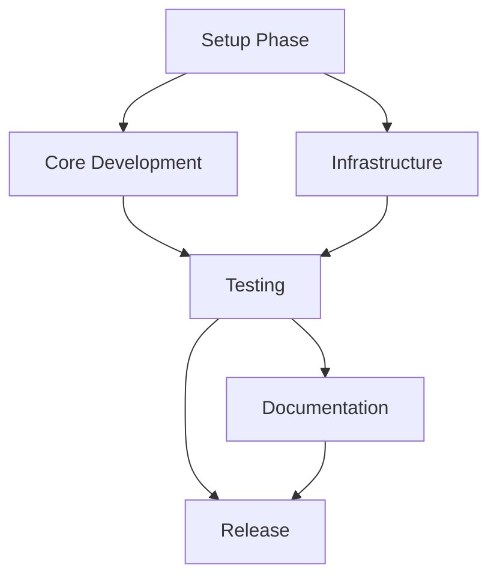

# Mobile App Feature - Agent Task Manager

## Agent Roles and Responsibilities

### Mobile App Developer
**Primary Focus**: React Native mobile application
- Implement UI screens (Search, Notification Setup, Saved Searches)
- Integrate with backend APIs
- Manage state with Redux
- Ensure cross-platform compatibility

### Backend/API Developer
**Primary Focus**: Server-side services
- Develop FastAPI gateway
- Implement notification service
- Manage database operations
- Integrate with existing MCP server

### DevOps Engineer
**Primary Focus**: Infrastructure and deployment
- Terraform infrastructure setup
- Docker containerization
- CI/CD pipeline
- AWS deployment and monitoring

### QA/Testing Specialist
**Primary Focus**: Quality assurance
- Mobile app testing (e2e, component, performance)
- API testing (unit, integration, load)
- Security and privacy validation

### Documentation Engineer
**Primary Focus**: Documentation
- Mobile app user guides
- API documentation
- Infrastructure guides

## Task Dependencies Overview



## Critical Path Tasks

### Week 1 - Foundation
```
Mobile App Developer: TASK-M001 (Project Setup)
Backend Developer: TASK-M002 (Backend Setup) + TASK-M004 (API Gateway)
DevOps Engineer: TASK-M003 (Infrastructure Setup)
```

### Week 2 - Core Features
```
Mobile App Developer: TASK-M005 (Search) + TASK-M006 (Notifications)
Backend Developer: TASK-M008 (Notification Service)
DevOps Engineer: TASK-M009 (Containerization) + TASK-M010 (Deployment)
```

### Week 3 - Integration
```
QA Specialist: TASK-M011 (Mobile Testing) + TASK-M012 (API Testing)
Documentation: TASK-M014 (Mobile Docs) + TASK-M015 (API Docs)
```

### Week 4 - Release
```
QA Specialist: TASK-M017 (End-to-End Testing)
Mobile Developer: TASK-M018 (App Store Prep)
DevOps Engineer: TASK-M019 (Production Release)
All: TASK-M016 (Infrastructure Docs)
```

## Key Integration Points

1. **API Contract** - Defined by TASK-M004 deliverables
2. **Database Schema** - Defined by TASK-M002 deliverables
3. **Infrastructure Requirements** - Defined by TASK-M003 deliverables
4. **Mobile State Management** - Coordinated between Mobile and Backend teams

## Daily Standup Focus

### Week 1
- Mobile: Environment setup, project structure
- Backend: FastAPI setup, database models
- DevOps: Terraform configuration, AWS resources

### Week 2
- Mobile: Search form implementation, API integration
- Backend: Notification service logic, SMS/email integration
- DevOps: Docker containers, deployment pipelines

### Week 3
- Mobile: Notification setup, saved searches
- Backend: Testing, security validation
- QA: Test suite development, integration testing

### Week 4
- All teams: Bug fixes, documentation, release preparation

## Success Criteria

1. **Mobile App**: Search and notification features working on iOS and Android
2. **Backend**: API gateway and notification service fully functional
3. **Infrastructure**: Deployed and monitored in AWS
4. **Quality**: >85% test coverage, security validated
5. **Documentation**: Complete user and technical documentation
6. **Release**: Production deployment ready, app store submission prepared

## Risk Indicators

🔴 **High Risk**: App store approval delays (TASK-M018)
🟡 **Medium Risk**: SMS/email delivery issues (TASK-M008)
🟢 **Low Risk**: Documentation completeness (TASK-M014-016)

Monitor these daily and escalate if needed.