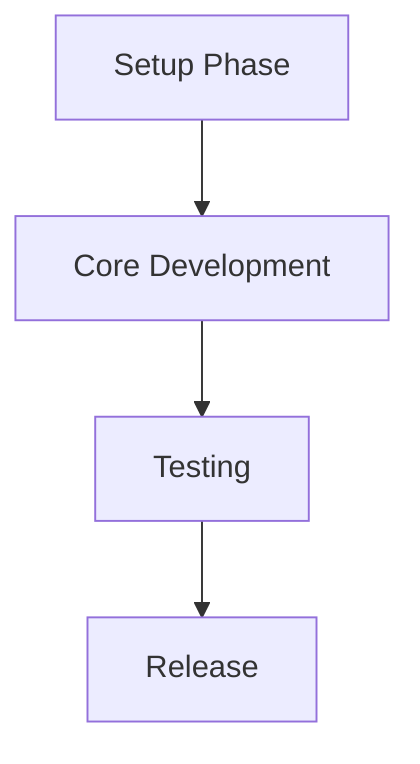

# Mobile App Feature - Agent Task Manager (Simplified)

## Agent Roles and Responsibilities

### Mobile App Developer
**Primary Focus**: React Native mobile application
- Implement UI screens (Search only)
- Direct integration with MCP server
- Manage local state
- Ensure cross-platform compatibility

### QA/Testing Specialist
**Primary Focus**: Quality assurance
- Mobile app testing (manual, device testing)
- Integration testing with MCP server

## Task Dependencies Overview



## Critical Path Tasks

### Days 1-2 - Foundation
```
Mobile App Developer: TASK-M001 ✅ COMPLETED (Project Setup) + TASK-M002 🔄 IN PROGRESS (MCP Integration)
```

### Days 3-5 - Core Features
```
Mobile App Developer: TASK-M003 (Search Screen) + TASK-M004 (UI Polish)
```

### Days 6-8 - Testing
```
QA Specialist: TASK-M005 (Mobile Testing) + TASK-M006 (Security Validation)
Mobile Developer: Support testing efforts
```

### Days 9-10 - Release
```
Mobile Developer: TASK-M007 (Documentation) + TASK-M008 (Build/Distribution)
```

## Key Integration Points

1. **MCP Connection** - Direct integration with existing ICE Locator MCP server
2. **Search Functionality** - Core feature connecting UI to MCP search tools
3. **Error Handling** - Graceful handling of network and MCP errors

## Daily Standup Focus

### Days 1-2
- Mobile: Environment setup, MCP client integration ✅ COMPLETED
- Mobile: MCP client implementation 🔄 IN PROGRESS

### Days 3-5
- Mobile: Search form implementation, UI development

### Days 6-8
- Mobile: Bug fixes, performance optimization
- QA: Testing on devices, reporting issues

### Days 9-10
- Mobile: Final build preparation, documentation

## Success Criteria

1. **Mobile App**: Search functionality working on iOS and Android
2. **Integration**: Direct MCP server communication functional
3. **Quality**: Tested on physical devices, error handling implemented
4. **Documentation**: User guide and release notes complete
5. **Release**: Production-ready builds for iOS and Android

## Risk Indicators

🟡 **Medium Risk**: ICE website changes affecting search functionality
🟢 **Low Risk**: Device compatibility issues

Monitor these daily and escalate if needed.