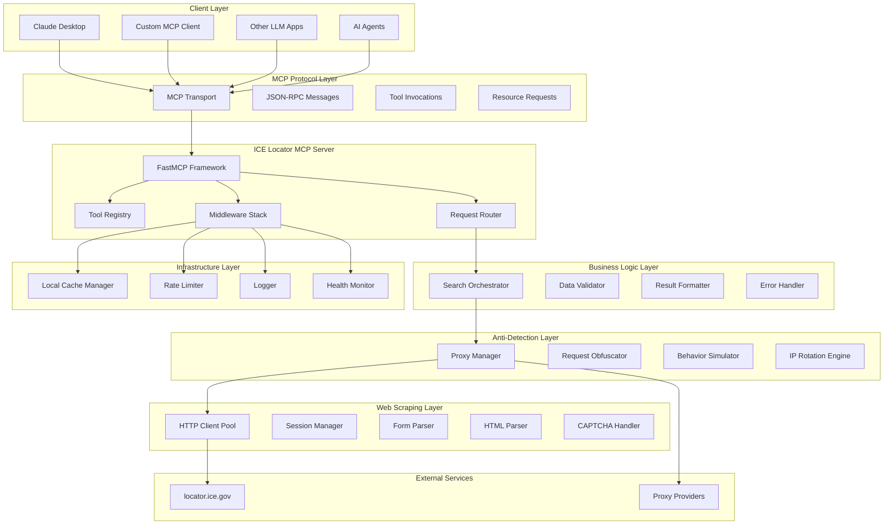
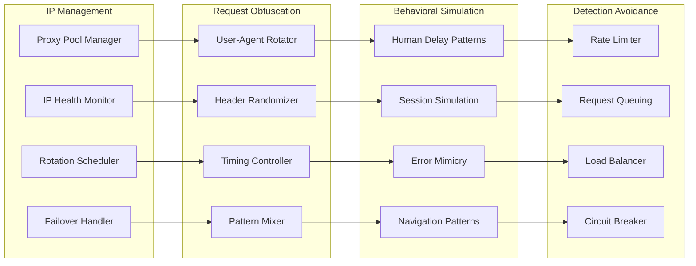
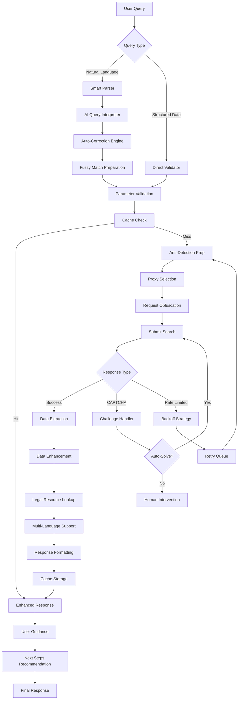

# ICE Locator MCP Server - Implementation Plan

## Project Overview

**Goal**: Build a Model Context Protocol (MCP) server that wraps locator.ice.gov for programmatic access to ICE detainee information.

**Timeline**: 3-4 weeks (accelerated delivery)
**Deployment Model**: Self-hosted (users clone and run locally)
**Target**: Polished GitHub repository ready for publication

## System Architecture Diagrams

### Core System Architecture

### Anti-Detection Architecture

### Enhanced User Experience Flow

## Enhanced Features & User Experience

### Core Search Capabilities
1. **Natural Language Processing**: "Find John Doe from Mexico born around 1990"
2. **Fuzzy Matching**: Handle name variations and misspellings
3. **Smart Auto-Corrections**: Suggest and apply common corrections
4. **Bulk Search Operations**: Search multiple detainees simultaneously
5. **Status Monitoring**: Track changes in custody status
6. **Comprehensive Reporting**: Generate legal-ready reports

### Anti-Detection Measures (MANDATORY)

#### 1. IP Cycling & Rotation
- Rotating proxy pool with health monitoring
- Geographic IP distribution
- Automatic rotation after N requests or time intervals
- Residential proxy preference over datacenter IPs

#### 2. Request Pattern Obfuscation
- Random delays between requests (1-5 seconds)
- Jitter implementation for timing randomness
- Request spacing to avoid burst patterns
- Realistic session duration simulation

#### 3. Browser Fingerprint Randomization
- User-agent rotation with realistic browser signatures
- HTTP header variation within normal ranges
- Accept-Language cycling for language preferences
- Viewport and screen resolution simulation

#### 4. Behavioral Mimicry
- Human-like navigation patterns
- Realistic form interaction delays
- Mouse movement simulation
- Human-like error handling

### Repository Discoverability Features

#### 1. GitHub Optimization
- **SEO-Optimized README**: Clear title, description, keywords
- **Topic Tags**: `mcp-server`, `ice-locator`, `immigration`, `legal-tech`
- **GitHub Actions**: Automated testing and release workflows
- **Documentation Site**: GitHub Pages with comprehensive docs
- **Example Configurations**: Multiple client setup examples

#### 2. MCP Ecosystem Integration
- **MCP Registry Submission**: Submit to official MCP server registry
- **Standard MCP Manifest**: Proper server manifest with capabilities
- **Client Configuration Examples**: Claude Desktop, Cursor, custom clients
- **Tool Documentation**: Comprehensive tool descriptions and examples

#### 3. Community Features
- **Issue Templates**: Bug reports, feature requests, help wanted
- **Contributing Guidelines**: Clear contribution process
- **Code of Conduct**: Welcoming community guidelines
- **Discussions**: Enable GitHub discussions for Q&A
- **Releases**: Semantic versioning with detailed changelogs

## Technology Stack (Simplified)

### Core Dependencies
- **MCP SDK**: Python MCP SDK 1.2.0+
- **HTTP Client**: `httpx` for async web requests
- **Web Scraping**: `beautifulsoup4` and `lxml`
- **Validation**: `pydantic` for data validation
- **Caching**: `diskcache` for local caching (no Redis)
- **Proxies**: `httpx-socks` for proxy support

### Development Dependencies
- **Testing**: `pytest`, `pytest-asyncio`, `pytest-mock`
- **Linting**: `ruff`, `mypy`
- **Documentation**: `mkdocs-material`

## Implementation Timeline (3-4 Weeks)

### Week 1: Foundation & Core Infrastructure
**Days 1-2**: Project Setup & Anti-Detection Framework
**Days 3-4**: Basic MCP Server Implementation
**Days 5-7**: Web Scraping Core & Form Handling

### Week 2: Search Features & Enhancement
**Days 8-9**: Core Search Tools Implementation
**Days 10-11**: Enhanced Search Features (Fuzzy, Bulk, Smart)
**Days 12-14**: Anti-Detection Testing & Optimization

### Week 3: Polish & Documentation
**Days 15-16**: Comprehensive Testing & Bug Fixes
**Days 17-18**: Documentation & Examples
**Days 19-21**: GitHub Repository Polish & Discoverability

### Week 4: Final Testing & Release
**Days 22-23**: End-to-End Testing & Performance Optimization
**Days 24-25**: Final Documentation Review
**Days 26-28**: Release Preparation & Community Setup

## Deliverables

### Core Deliverables
1. **Functional MCP Server** with all search capabilities
2. **Anti-Detection System** with IP rotation and obfuscation
3. **Comprehensive Documentation** including setup and usage guides
4. **Test Suite** with >90% coverage
5. **Example Configurations** for popular MCP clients

### Repository Assets
1. **Professional README** with clear installation and usage
2. **API Documentation** with tool descriptions and examples
3. **Contributing Guidelines** and issue templates
4. **GitHub Actions** for CI/CD and releases
5. **Security Guidelines** and responsible usage policies

### Community Features
1. **MCP Registry Listing** for discoverability
2. **Discussion Forums** for community support
3. **Example Integrations** with Claude Desktop and other clients
4. **Video Tutorials** (if time permits)
5. **Legal Resources** and responsible usage documentation

This implementation plan ensures rapid delivery while maintaining high quality standards and maximum discoverability for AI agents and the broader community.