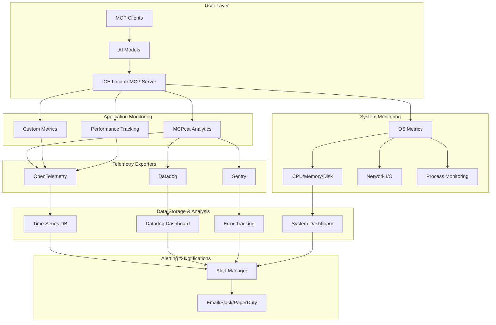

# Advanced Monitoring & Analytics Plan - MCPcat Integration

## 🎯 Overview

Enhance the ICE Locator MCP Server with comprehensive monitoring, analytics, and observability using **MCPcat** (analytics platform for MCP servers) combined with OS-level monitoring tools for complete visibility into user behavior, system performance, and operational health.

## 📊 Monitoring Architecture

### Multi-Layer Monitoring Stack


## 🔧 Technical Requirements

### MCPcat Integration Requirements
- **Analytics Platform**: User session tracking and behavior analysis
- **Tool Call Monitoring**: Detailed insights into MCP tool usage patterns
- **Performance Metrics**: Response times, success rates, error tracking
- **User Journey Analysis**: Understanding AI agent interactions
- **Privacy-First Design**: Data redaction and encryption at rest

### OS-Level Monitoring Requirements
- **System Resource Monitoring**: CPU, memory, disk, network utilization
- **Process Monitoring**: MCP server process health and resource usage
- **Network Monitoring**: Connection patterns, proxy usage, rate limiting
- **Security Monitoring**: Failed authentication attempts, suspicious activity
- **Performance Bottlenecks**: Identification and alerting of system constraints

### Telemetry Export Requirements
- **OpenTelemetry**: Standard telemetry data export for interoperability
- **Datadog Integration**: Comprehensive APM and infrastructure monitoring
- **Sentry Integration**: Error tracking and performance monitoring
- **Custom Exporters**: ICE-specific metrics and compliance tracking

## 📋 Implementation Tasks

### Phase 5.1: MCPcat Analytics Integration (P5F1T019)

#### Core Integration
- [ ] Install `mcpcat` Python SDK
- [ ] Create MCPcat project and obtain project ID
- [ ] Integrate tracking with existing FastMCP server
- [ ] Configure basic analytics collection

#### User Session Analytics
- [ ] Implement user identification callback
- [ ] Track MCP tool usage patterns
- [ ] Monitor AI model interaction flows
- [ ] Capture search query patterns and success rates

#### Tool Call Monitoring
- [ ] Track all ICE search tool invocations
- [ ] Monitor search parameters and result patterns
- [ ] Analyze fuzzy matching effectiveness
- [ ] Track anti-detection strategy performance

```python
# Implementation example
import mcpcat
from mcp.server import FastMCP

def identify_user(request, extra):
    # Extract user context from MCP request
    return UserIdentity(
        user_id=request.session_id,
        user_data={
            "client_type": detect_client_type(request),
            "search_patterns": analyze_patterns(request),
            "language_preference": detect_language(request)
        }
    )

def redact_sensitive_data(text):
    # Remove PII from analytics data
    return sanitize_personal_info(text)

mcpcat.track(
    server, 
    "proj_ice_locator_analytics",
    MCPCatOptions(
        identify=identify_user,
        redact_sensitive_information=redact_sensitive_data
    )
)
```

### Phase 5.2: Advanced Telemetry Framework (P5F2T020)

#### OpenTelemetry Integration
- [ ] Configure OTLP exporter for traces and metrics
- [ ] Implement custom span creation for search operations
- [ ] Add distributed tracing across anti-detection components
- [ ] Create performance metrics for proxy rotation

#### Datadog Integration
- [ ] Set up Datadog APM for application performance monitoring
- [ ] Configure infrastructure monitoring for server metrics
- [ ] Create custom dashboards for ICE-specific metrics
- [ ] Implement log aggregation and analysis

#### Sentry Integration
- [ ] Configure error tracking and performance monitoring
- [ ] Set up release tracking and deployment notifications
- [ ] Implement custom error contexts for search failures
- [ ] Add performance profiling for bottleneck identification

```python
# Telemetry configuration example
from mcpcat import MCPCatOptions, ExporterConfig
import os

telemetry_config = MCPCatOptions(
    exporters={
        "otlp": ExporterConfig(
            type="otlp",
            endpoint="http://localhost:4318/v1/traces"
        ),
        "datadog": ExporterConfig(
            type="datadog",
            api_key=os.getenv("DD_API_KEY"),
            site="datadoghq.com",
            service="ice-locator-mcp",
            tags={"environment": "production", "version": "1.0.0"}
        ),
        "sentry": ExporterConfig(
            type="sentry",
            dsn=os.getenv("SENTRY_DSN"),
            environment="production",
            traces_sample_rate=0.1
        )
    }
)
```

### Phase 5.3: User Analytics and Session Replay (P5F3T021)

#### Behavior Pattern Analysis
- [ ] Track user session duration and activity patterns
- [ ] Monitor search query complexity and evolution
- [ ] Analyze anti-detection effectiveness per user
- [ ] Identify common user workflows and pain points

#### AI Usage Insights
- [ ] Track which AI models are using the server
- [ ] Monitor tool selection patterns by AI agents
- [ ] Analyze natural language query processing effectiveness
- [ ] Measure Spanish language usage and effectiveness

#### Session Replay Features
- [ ] Implement session recording for debugging
- [ ] Create user journey visualization
- [ ] Track cross-session behavior patterns
- [ ] Monitor long-term user engagement

### Phase 5.4: OS-Level Monitoring Integration (P5F4T022)

#### System Resource Monitoring
- [ ] Integrate with `psutil` for Python-based system monitoring
- [ ] Monitor CPU usage during search operations
- [ ] Track memory consumption patterns
- [ ] Monitor disk I/O for cache operations

#### Network Monitoring
- [ ] Track proxy connection health and performance
- [ ] Monitor rate limiting effectiveness
- [ ] Analyze network latency patterns
- [ ] Track connection pool utilization

#### Process Health Monitoring
- [ ] Monitor MCP server process health
- [ ] Track background task performance
- [ ] Monitor anti-detection component health
- [ ] Implement automatic restart mechanisms

```python
# OS monitoring integration example
import psutil
import time
from dataclasses import dataclass
from typing import Dict, Any

@dataclass
class SystemMetrics:
    cpu_percent: float
    memory_percent: float
    disk_io: Dict[str, Any]
    network_io: Dict[str, Any]
    active_connections: int
    
class OSMonitor:
    def __init__(self):
        self.process = psutil.Process()
        
    async def collect_metrics(self) -> SystemMetrics:
        return SystemMetrics(
            cpu_percent=self.process.cpu_percent(),
            memory_percent=self.process.memory_percent(),
            disk_io=psutil.disk_io_counters()._asdict(),
            network_io=psutil.net_io_counters()._asdict(),
            active_connections=len(self.process.connections())
        )
```

### Phase 5.5: Monitoring Dashboard and Alerts (P5F5T023)

#### Dashboard Creation
- [ ] Create comprehensive monitoring dashboard
- [ ] Implement real-time metrics visualization
- [ ] Design user analytics and behavior dashboards
- [ ] Create system health overview dashboard

#### Alerting System
- [ ] Configure threshold-based alerts
- [ ] Implement anomaly detection for unusual patterns
- [ ] Set up escalation procedures for critical issues
- [ ] Create notification channels (email, Slack, PagerDuty)

#### Performance Optimization
- [ ] Identify performance bottlenecks through monitoring
- [ ] Implement automated performance tuning
- [ ] Create performance regression detection
- [ ] Monitor and optimize anti-detection strategies

### Phase 5.6: Privacy and Security Monitoring (P5F6T024)

#### Data Protection
- [ ] Implement comprehensive data redaction
- [ ] Monitor for sensitive information leaks
- [ ] Ensure compliance with privacy regulations
- [ ] Create audit trails for data access

#### Security Monitoring
- [ ] Monitor for suspicious usage patterns
- [ ] Track failed authentication attempts
- [ ] Detect potential abuse or misuse
- [ ] Implement rate limiting monitoring

#### Compliance Tracking
- [ ] Monitor adherence to legal guidelines
- [ ] Track usage pattern compliance
- [ ] Generate compliance reports
- [ ] Implement automated compliance checks

## 🏗️ Architecture Components

### New Monitoring Modules
```
src/ice_locator_mcp/monitoring/
├── __init__.py
├── mcpcat_integration.py      # MCPcat analytics integration
├── telemetry_exporters.py     # OpenTelemetry, Datadog, Sentry
├── user_analytics.py          # User behavior and session tracking
├── os_monitoring.py           # System resource monitoring
├── dashboard.py               # Monitoring dashboard
├── alerting.py                # Alert management and notifications
├── privacy_monitor.py         # Data redaction and privacy
└── compliance_tracker.py      # Legal compliance monitoring
```

### Configuration Updates
```python
# Add to ServerConfig
@dataclass
class MonitoringConfig:
    mcpcat_enabled: bool = True
    mcpcat_project_id: str = ""
    telemetry_exporters: Dict[str, ExporterConfig] = field(default_factory=dict)
    os_monitoring_enabled: bool = True
    dashboard_enabled: bool = True
    alerting_enabled: bool = True
    privacy_redaction_enabled: bool = True
    compliance_tracking_enabled: bool = True
```

## 📦 Dependencies

### New Python Dependencies
```toml
# Add to pyproject.toml
dependencies = [
    # ... existing dependencies ...
    "mcpcat>=1.0.0",                    # MCPcat analytics platform
    "opentelemetry-api>=1.20.0",       # OpenTelemetry API
    "opentelemetry-sdk>=1.20.0",       # OpenTelemetry SDK
    "opentelemetry-exporter-otlp>=1.20.0",  # OTLP exporter
    "psutil>=5.9.0",                    # System monitoring
    "prometheus-client>=0.19.0",        # Prometheus metrics
    "grafana-api>=1.0.3",              # Grafana integration
]

[project.optional-dependencies]
monitoring = [
    "datadog>=0.47.0",                 # Datadog integration
    "sentry-sdk>=1.40.0",              # Sentry error tracking
    "pagerduty-api>=1.0.0",            # PagerDuty alerting
    "slack-sdk>=3.20.0",               # Slack notifications
]
```

## 🎯 Success Metrics

### Analytics Metrics
- **User Engagement**: Session duration, tool usage frequency
- **Search Effectiveness**: Success rates, query patterns
- **Performance**: Response times, error rates
- **AI Behavior**: Model usage patterns, tool selection

### System Metrics
- **Resource Utilization**: CPU, memory, disk usage optimization
- **Network Performance**: Proxy efficiency, connection health
- **Reliability**: Uptime, error recovery, stability
- **Security**: Threat detection, compliance adherence

### Business Metrics
- **User Satisfaction**: Error rates, success patterns
- **Operational Efficiency**: Resource cost optimization
- **Compliance**: Legal guideline adherence
- **Community Growth**: Usage adoption, feedback patterns

## 🚀 Implementation Timeline

### Week 1: Core MCPcat Integration (P5F1T019)
- Day 1-2: MCPcat SDK installation and basic integration
- Day 3-4: User identification and session tracking
- Day 5-7: Tool call monitoring and analytics collection

### Week 2: Telemetry Framework (P5F2T020)
- Day 1-3: OpenTelemetry integration and custom spans
- Day 4-5: Datadog APM and infrastructure monitoring
- Day 6-7: Sentry error tracking and performance monitoring

### Week 3: Advanced Analytics (P5F3T021 + P5F4T022)
- Day 1-3: User analytics and session replay features
- Day 4-7: OS-level monitoring integration

### Week 4: Dashboard and Security (P5F5T023 + P5F6T024)
- Day 1-4: Monitoring dashboard and alerting system
- Day 5-7: Privacy and security monitoring features

## 💡 Benefits

### For Developers
- **Deep Insights**: Understanding actual user needs and pain points
- **Performance Optimization**: Data-driven performance improvements
- **Debugging**: Comprehensive tracing and error tracking
- **Quality Assurance**: Automated monitoring and alerting

### For Users
- **Improved Reliability**: Proactive issue detection and resolution
- **Better Performance**: Optimized based on real usage patterns
- **Enhanced Privacy**: Comprehensive data protection monitoring
- **Transparent Operations**: Clear visibility into system health

### For Operations
- **Proactive Monitoring**: Early warning systems for issues
- **Compliance Assurance**: Automated compliance tracking
- **Resource Optimization**: Efficient resource utilization
- **Security Enhancement**: Comprehensive security monitoring

---

This monitoring enhancement will provide world-class observability for the ICE Locator MCP Server, enabling data-driven improvements and ensuring reliable, secure, and compliant operations.