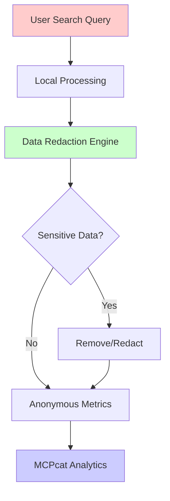

# Privacy Policy - ICE Locator MCP Server

## 🛡️ Our Privacy Commitment

The ICE Locator MCP Server is designed with **privacy-first principles**. We understand the sensitive nature of immigration-related searches and have implemented comprehensive safeguards to protect user privacy and sensitive information.

## 📊 Analytics & Monitoring (MCPcat Integration)

### What is MCPcat?
[MCPcat](https://mcpcat.io) is an analytics platform specifically designed for Model Context Protocol (MCP) servers. It helps developers understand usage patterns to improve software quality and reliability.

### Data Collection Philosophy
**We collect metrics, not personal data.** Our integration focuses solely on:
- Understanding how the software is used (not what it's used for)
- Improving performance and reliability
- Ensuring compatibility with different AI models
- Identifying and fixing bugs

## 🔒 Data Protection Measures

### Automatic Data Redaction
**All sensitive information is automatically removed before any data leaves your machine:**

#### What Gets Redacted:
- ✅ **Names**: All personal names (first, last, middle)
- ✅ **A-Numbers**: Alien registration numbers
- ✅ **Dates of Birth**: Personal birthdates
- ✅ **Countries of Birth**: Personal origin information
- ✅ **Search Results**: Facility names, locations, custody status
- ✅ **Personal Identifiers**: Any information that could identify individuals

#### Redaction Process:
```python
# Example of automatic redaction
Original Query: "Find Maria Rodriguez, A123456789, born 1985-03-15"
Redacted Query: "Find [NAME], [A_NUMBER], born [DATE]"

Original Result: "Found at Houston Processing Center"
Redacted Result: "Found at [FACILITY_NAME]"
```

### What Data Is Actually Collected

#### ✅ Performance Metrics (Collected)
- Tool usage frequency (e.g., "name search used 85% of time")
- Response times and success rates
- Error types and frequencies
- AI model compatibility patterns
- Search attempt counts (not content)

#### ❌ Personal Data (NOT Collected)
- Individual names or identifiers
- Search query content
- Search results or findings
- Facility information
- User identification
- Location data
- Case details

### Data Flow Example


## 🔧 Privacy Controls

### Complete Opt-Out
Analytics can be completely disabled:

```bash
# Environment variable
export ICE_LOCATOR_ANALYTICS_ENABLED=false

# Configuration file
analytics:
  enabled: false
```

### Granular Controls
Fine-tune what gets collected:

```bash
# Strict redaction mode
export ICE_LOCATOR_REDACTION_LEVEL=strict

# Performance metrics only
export ICE_LOCATOR_ANALYTICS_MODE=performance_only

# Local-only mode (no external transmission)
export ICE_LOCATOR_ANALYTICS_LOCAL_ONLY=true
```

### Custom Redaction
Define your own redaction rules:

```python
# Custom redaction function
def custom_redact(text):
    # Your custom redaction logic
    return sanitize_with_custom_rules(text)

mcpcat.track(server, project_id, redact_function=custom_redact)
```

## 📋 Data Processing Details

### Local Processing
- **All redaction happens on your machine** before any data transmission
- **Search operations are processed locally** using your system resources
- **Cache storage is local** and can be encrypted or disabled

### External Communication
- **Only anonymized metrics** are transmitted to MCPcat servers
- **All communication uses encrypted HTTPS** connections
- **No personal search data** ever leaves your environment

### Data Storage
- **No persistent storage** of search queries or results
- **Optional local caching** with configurable encryption
- **Analytics data stored securely** with industry-standard encryption

## 🏛️ Legal Compliance

### Privacy Regulations
- **GDPR Compliant**: Data minimization and purpose limitation
- **CCPA Compliant**: California privacy rights respected
- **PIPEDA Compliant**: Canadian privacy law adherence
- **Sector-Specific**: Immigration law privacy considerations

### Data Subject Rights
- **Right to Opt-Out**: Complete analytics disabling
- **Right to Access**: View what analytics data is collected
- **Right to Deletion**: Request deletion of any stored analytics
- **Right to Portability**: Export your configuration and preferences

## 🔍 Transparency & Auditing

### Open Source Commitment
- **All analytics code is open source** and available for review
- **Redaction algorithms are publicly auditable**
- **No hidden data collection** or undisclosed metrics

### Regular Security Audits
- **Quarterly privacy reviews** of data collection practices
- **Security assessments** of redaction effectiveness
- **Community oversight** through open source development

### Data Audit Logs
```bash
# View what data would be sent (without sending)
ice-locator-mcp --audit-analytics

# Generate privacy compliance report
ice-locator-mcp --privacy-report
```

## 🌐 International Considerations

### Cross-Border Data Transfers
- **Analytics data may be processed internationally** by MCPcat infrastructure
- **Only anonymized, redacted data** crosses borders
- **No personal information** is subject to international transfer

### Jurisdictional Compliance
- **Compliance with local laws** is user responsibility
- **Privacy controls adapt** to regional requirements
- **Data residency options** available for sensitive deployments

## 📞 Privacy Contact & Requests

### Contact Information
- **Privacy Concerns**: privacy@ice-locator-mcp.org
- **Data Requests**: data-requests@ice-locator-mcp.org
- **Security Issues**: security@ice-locator-mcp.org
- **General Support**: support@ice-locator-mcp.org

### Response Times
- **Privacy inquiries**: 72 hours
- **Data deletion requests**: 7 days
- **Security concerns**: 24 hours
- **General questions**: 5 business days

## 🔄 Policy Updates

### Notification Process
- **Email notifications** for significant privacy policy changes
- **GitHub releases** with privacy impact assessments
- **30-day notice period** for material changes
- **Opt-in required** for new data collection types

### Version History
- **v1.0.0**: Initial privacy policy with MCPcat integration
- **Future versions** will be documented with change summaries

## ❓ Frequently Asked Questions

### Q: Can you see my search results?
**A: No.** All search results are redacted before any analytics collection. We only see anonymized patterns like "search completed successfully" or "search returned error."

### Q: Do you know who I am?
**A: No.** We don't collect usernames, IP addresses, or any identifying information. Analytics are completely anonymous.

### Q: Can I use this without analytics?
**A: Yes.** Analytics can be completely disabled with a single configuration change.

### Q: How do I know data is actually redacted?
**A: The redaction code is open source** and auditable. You can review exactly what gets redacted and how.

### Q: What happens if I find a privacy issue?
**A: Please report it immediately** to security@ice-locator-mcp.org. We take privacy seriously and will respond within 24 hours.

---

**Last Updated**: January 2024  
**Policy Version**: 1.0.0  
**Contact**: privacy@ice-locator-mcp.org

> **Privacy First**: This policy reflects our commitment to protecting the privacy and dignity of individuals seeking immigration-related information. When in doubt, we err on the side of privacy protection.